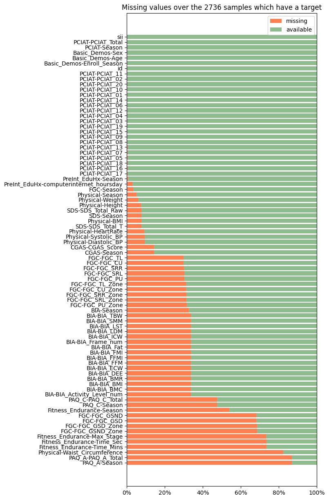
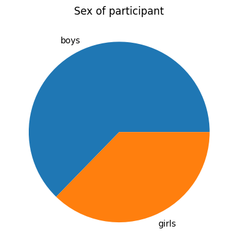
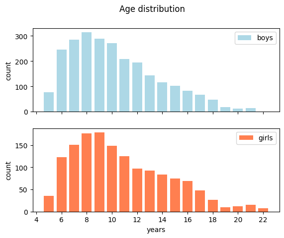
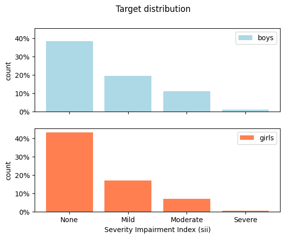
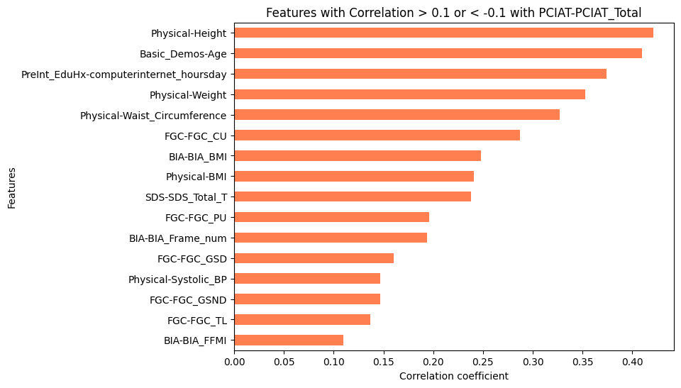
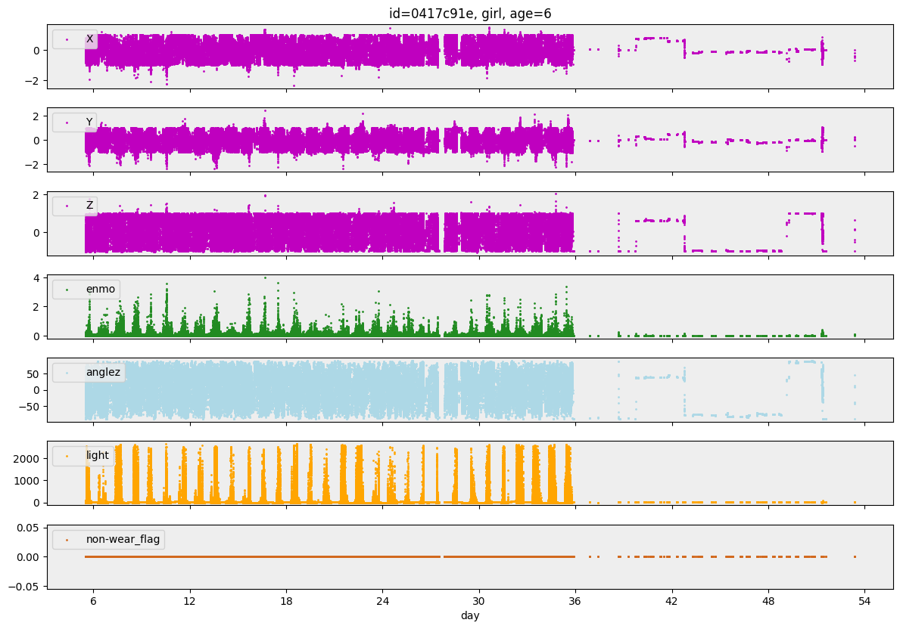

```python
!pip -q install /kaggle/input/pytorchtabnet/pytorch_tabnet-4.1.0-py3-none-any.whl
```


```python
import numpy as np
import pandas as pd
import os
import re
from sklearn.base import clone
from sklearn.metrics import cohen_kappa_score
from sklearn.model_selection import StratifiedKFold
from scipy.optimize import minimize
from concurrent.futures import ThreadPoolExecutor
from tqdm import tqdm
import polars as pl
import polars.selectors as cs
import matplotlib.pyplot as plt
from matplotlib.ticker import MaxNLocator, FormatStrFormatter, PercentFormatter
import seaborn as sns

from sklearn.preprocessing import StandardScaler
import matplotlib.pyplot as plt
from keras.models import Model
from keras.layers import Input, Dense
from keras.optimizers import Adam
import torch
import torch.nn as nn
import torch.optim as optim

from colorama import Fore, Style
from IPython.display import clear_output
import warnings
from lightgbm import LGBMRegressor
from xgboost import XGBRegressor
from catboost import CatBoostRegressor
from sklearn.ensemble import VotingRegressor, RandomForestRegressor, GradientBoostingRegressor
from sklearn.impute import SimpleImputer, KNNImputer
from sklearn.pipeline import Pipeline

# 对少数类进行过采样
from imblearn.over_sampling import SMOTE, ADASYN
from collections import Counter

# TabNet
from sklearn.base import BaseEstimator, RegressorMixin
from sklearn.impute import SimpleImputer
from sklearn.model_selection import train_test_split
from pytorch_tabnet.callbacks import Callback
import os
import torch
from pytorch_tabnet.callbacks import Callback

warnings.filterwarnings('ignore')
pd.options.display.max_columns = None
```

# 基本情况


```python
# sii:0,1,2,3
target_labels = ['None', 'Mild', 'Moderate', 'Severe']
```

定义了一个名为 season_dtype 的枚举类型，包含四个季节：春季（Spring）、夏季（Summer）、秋季（Fall）和冬季（Winter）。使用枚举类型可以确保数据的有效性和一致性，特别是在处理分类数据时。


```python
season_dtype = pl.Enum(['Spring', 'Summer', 'Fall', 'Winter'])

# 正则匹配包含“Season”的列名，并转换为枚举类型
train = (
    pl.read_csv('/kaggle/input/child-mind-institute-problematic-internet-use/train.csv')
    .with_columns(pl.col('^.*Season$').cast(season_dtype))
)

test = (
    pl.read_csv('/kaggle/input/child-mind-institute-problematic-internet-use/test.csv')
    .with_columns(pl.col('^.*Season$').cast(season_dtype))
)

train
test
```


<div><style>
.dataframe > thead > tr,
.dataframe > tbody > tr {
  text-align: right;
  white-space: pre-wrap;
}
</style>
<small>shape: (20, 59)</small><table border="1" class="dataframe"><thead><tr><th>id</th><th>Basic_Demos-Enroll_Season</th><th>Basic_Demos-Age</th><th>Basic_Demos-Sex</th><th>CGAS-Season</th><th>CGAS-CGAS_Score</th><th>Physical-Season</th><th>Physical-BMI</th><th>Physical-Height</th><th>Physical-Weight</th><th>Physical-Waist_Circumference</th><th>Physical-Diastolic_BP</th><th>Physical-HeartRate</th><th>Physical-Systolic_BP</th><th>Fitness_Endurance-Season</th><th>Fitness_Endurance-Max_Stage</th><th>Fitness_Endurance-Time_Mins</th><th>Fitness_Endurance-Time_Sec</th><th>FGC-Season</th><th>FGC-FGC_CU</th><th>FGC-FGC_CU_Zone</th><th>FGC-FGC_GSND</th><th>FGC-FGC_GSND_Zone</th><th>FGC-FGC_GSD</th><th>FGC-FGC_GSD_Zone</th><th>FGC-FGC_PU</th><th>FGC-FGC_PU_Zone</th><th>FGC-FGC_SRL</th><th>FGC-FGC_SRL_Zone</th><th>FGC-FGC_SRR</th><th>FGC-FGC_SRR_Zone</th><th>FGC-FGC_TL</th><th>FGC-FGC_TL_Zone</th><th>BIA-Season</th><th>BIA-BIA_Activity_Level_num</th><th>BIA-BIA_BMC</th><th>BIA-BIA_BMI</th><th>BIA-BIA_BMR</th><th>BIA-BIA_DEE</th><th>BIA-BIA_ECW</th><th>BIA-BIA_FFM</th><th>BIA-BIA_FFMI</th><th>BIA-BIA_FMI</th><th>BIA-BIA_Fat</th><th>BIA-BIA_Frame_num</th><th>BIA-BIA_ICW</th><th>BIA-BIA_LDM</th><th>BIA-BIA_LST</th><th>BIA-BIA_SMM</th><th>BIA-BIA_TBW</th><th>PAQ_A-Season</th><th>PAQ_A-PAQ_A_Total</th><th>PAQ_C-Season</th><th>PAQ_C-PAQ_C_Total</th><th>SDS-Season</th><th>SDS-SDS_Total_Raw</th><th>SDS-SDS_Total_T</th><th>PreInt_EduHx-Season</th><th>PreInt_EduHx-computerinternet_hoursday</th></tr><tr><td>str</td><td>enum</td><td>i64</td><td>i64</td><td>enum</td><td>i64</td><td>enum</td><td>f64</td><td>f64</td><td>f64</td><td>f64</td><td>i64</td><td>i64</td><td>i64</td><td>enum</td><td>i64</td><td>i64</td><td>i64</td><td>enum</td><td>i64</td><td>i64</td><td>f64</td><td>i64</td><td>f64</td><td>i64</td><td>i64</td><td>i64</td><td>f64</td><td>i64</td><td>f64</td><td>i64</td><td>f64</td><td>i64</td><td>enum</td><td>i64</td><td>f64</td><td>f64</td><td>f64</td><td>f64</td><td>f64</td><td>f64</td><td>f64</td><td>f64</td><td>f64</td><td>i64</td><td>f64</td><td>f64</td><td>f64</td><td>f64</td><td>f64</td><td>enum</td><td>f64</td><td>enum</td><td>f64</td><td>enum</td><td>i64</td><td>i64</td><td>enum</td><td>i64</td></tr></thead><tbody><tr><td>&quot;00008ff9&quot;</td><td>&quot;Fall&quot;</td><td>5</td><td>0</td><td>&quot;Winter&quot;</td><td>51</td><td>&quot;Fall&quot;</td><td>16.877316</td><td>46.0</td><td>50.8</td><td>null</td><td>null</td><td>null</td><td>null</td><td>null</td><td>null</td><td>null</td><td>null</td><td>&quot;Fall&quot;</td><td>0</td><td>0</td><td>null</td><td>null</td><td>null</td><td>null</td><td>0</td><td>0</td><td>7.0</td><td>0</td><td>6.0</td><td>0</td><td>6.0</td><td>1</td><td>&quot;Fall&quot;</td><td>2</td><td>2.66855</td><td>16.8792</td><td>932.498</td><td>1492.0</td><td>8.25598</td><td>41.5862</td><td>13.8177</td><td>3.06143</td><td>9.21377</td><td>1</td><td>24.4349</td><td>8.89536</td><td>38.9177</td><td>19.5413</td><td>32.6909</td><td>null</td><td>null</td><td>null</td><td>null</td><td>null</td><td>null</td><td>null</td><td>&quot;Fall&quot;</td><td>3</td></tr><tr><td>&quot;000fd460&quot;</td><td>&quot;Summer&quot;</td><td>9</td><td>0</td><td>null</td><td>null</td><td>&quot;Fall&quot;</td><td>14.03559</td><td>48.0</td><td>46.0</td><td>22.0</td><td>75</td><td>70</td><td>122</td><td>null</td><td>null</td><td>null</td><td>null</td><td>&quot;Fall&quot;</td><td>3</td><td>0</td><td>null</td><td>null</td><td>null</td><td>null</td><td>5</td><td>0</td><td>11.0</td><td>1</td><td>11.0</td><td>1</td><td>3.0</td><td>0</td><td>&quot;Winter&quot;</td><td>2</td><td>2.57949</td><td>14.0371</td><td>936.656</td><td>1498.65</td><td>6.01993</td><td>42.0291</td><td>12.8254</td><td>1.21172</td><td>3.97085</td><td>1</td><td>21.0352</td><td>14.974</td><td>39.4497</td><td>15.4107</td><td>27.0552</td><td>null</td><td>null</td><td>&quot;Fall&quot;</td><td>2.34</td><td>&quot;Fall&quot;</td><td>46</td><td>64</td><td>&quot;Summer&quot;</td><td>0</td></tr><tr><td>&quot;00105258&quot;</td><td>&quot;Summer&quot;</td><td>10</td><td>1</td><td>&quot;Fall&quot;</td><td>71</td><td>&quot;Fall&quot;</td><td>16.648696</td><td>56.5</td><td>75.6</td><td>null</td><td>65</td><td>94</td><td>117</td><td>&quot;Fall&quot;</td><td>5</td><td>7</td><td>33</td><td>&quot;Fall&quot;</td><td>20</td><td>1</td><td>10.2</td><td>1</td><td>14.7</td><td>2</td><td>7</td><td>1</td><td>10.0</td><td>1</td><td>10.0</td><td>1</td><td>5.0</td><td>0</td><td>null</td><td>null</td><td>null</td><td>null</td><td>null</td><td>null</td><td>null</td><td>null</td><td>null</td><td>null</td><td>null</td><td>null</td><td>null</td><td>null</td><td>null</td><td>null</td><td>null</td><td>null</td><td>null</td><td>&quot;Summer&quot;</td><td>2.17</td><td>&quot;Fall&quot;</td><td>38</td><td>54</td><td>&quot;Summer&quot;</td><td>2</td></tr><tr><td>&quot;00115b9f&quot;</td><td>&quot;Winter&quot;</td><td>9</td><td>0</td><td>&quot;Fall&quot;</td><td>71</td><td>&quot;Summer&quot;</td><td>18.292347</td><td>56.0</td><td>81.6</td><td>null</td><td>60</td><td>97</td><td>117</td><td>&quot;Summer&quot;</td><td>6</td><td>9</td><td>37</td><td>&quot;Summer&quot;</td><td>18</td><td>1</td><td>null</td><td>null</td><td>null</td><td>null</td><td>5</td><td>0</td><td>7.0</td><td>0</td><td>7.0</td><td>0</td><td>7.0</td><td>1</td><td>&quot;Summer&quot;</td><td>3</td><td>3.84191</td><td>18.2943</td><td>1131.43</td><td>1923.44</td><td>15.5925</td><td>62.7757</td><td>14.074</td><td>4.22033</td><td>18.8243</td><td>2</td><td>30.4041</td><td>16.779</td><td>58.9338</td><td>26.4798</td><td>45.9966</td><td>null</td><td>null</td><td>&quot;Winter&quot;</td><td>2.451</td><td>&quot;Summer&quot;</td><td>31</td><td>45</td><td>&quot;Winter&quot;</td><td>0</td></tr><tr><td>&quot;0016bb22&quot;</td><td>&quot;Spring&quot;</td><td>18</td><td>1</td><td>&quot;Summer&quot;</td><td>null</td><td>null</td><td>null</td><td>null</td><td>null</td><td>null</td><td>null</td><td>null</td><td>null</td><td>null</td><td>null</td><td>null</td><td>null</td><td>null</td><td>null</td><td>null</td><td>null</td><td>null</td><td>null</td><td>null</td><td>null</td><td>null</td><td>null</td><td>null</td><td>null</td><td>null</td><td>null</td><td>null</td><td>null</td><td>null</td><td>null</td><td>null</td><td>null</td><td>null</td><td>null</td><td>null</td><td>null</td><td>null</td><td>null</td><td>null</td><td>null</td><td>null</td><td>null</td><td>null</td><td>null</td><td>&quot;Summer&quot;</td><td>1.04</td><td>null</td><td>null</td><td>null</td><td>null</td><td>null</td><td>null</td><td>null</td></tr><tr><td>&hellip;</td><td>&hellip;</td><td>&hellip;</td><td>&hellip;</td><td>&hellip;</td><td>&hellip;</td><td>&hellip;</td><td>&hellip;</td><td>&hellip;</td><td>&hellip;</td><td>&hellip;</td><td>&hellip;</td><td>&hellip;</td><td>&hellip;</td><td>&hellip;</td><td>&hellip;</td><td>&hellip;</td><td>&hellip;</td><td>&hellip;</td><td>&hellip;</td><td>&hellip;</td><td>&hellip;</td><td>&hellip;</td><td>&hellip;</td><td>&hellip;</td><td>&hellip;</td><td>&hellip;</td><td>&hellip;</td><td>&hellip;</td><td>&hellip;</td><td>&hellip;</td><td>&hellip;</td><td>&hellip;</td><td>&hellip;</td><td>&hellip;</td><td>&hellip;</td><td>&hellip;</td><td>&hellip;</td><td>&hellip;</td><td>&hellip;</td><td>&hellip;</td><td>&hellip;</td><td>&hellip;</td><td>&hellip;</td><td>&hellip;</td><td>&hellip;</td><td>&hellip;</td><td>&hellip;</td><td>&hellip;</td><td>&hellip;</td><td>&hellip;</td><td>&hellip;</td><td>&hellip;</td><td>&hellip;</td><td>&hellip;</td><td>&hellip;</td><td>&hellip;</td><td>&hellip;</td><td>&hellip;</td></tr><tr><td>&quot;00c0cd71&quot;</td><td>&quot;Winter&quot;</td><td>7</td><td>0</td><td>&quot;Summer&quot;</td><td>51</td><td>&quot;Spring&quot;</td><td>29.315775</td><td>54.0</td><td>121.6</td><td>null</td><td>80</td><td>75</td><td>99</td><td>&quot;Spring&quot;</td><td>4</td><td>5</td><td>32</td><td>&quot;Spring&quot;</td><td>6</td><td>1</td><td>null</td><td>null</td><td>null</td><td>null</td><td>0</td><td>0</td><td>12.0</td><td>1</td><td>15.0</td><td>1</td><td>12.0</td><td>1</td><td>null</td><td>null</td><td>null</td><td>null</td><td>null</td><td>null</td><td>null</td><td>null</td><td>null</td><td>null</td><td>null</td><td>null</td><td>null</td><td>null</td><td>null</td><td>null</td><td>null</td><td>null</td><td>null</td><td>null</td><td>null</td><td>&quot;Spring&quot;</td><td>35</td><td>50</td><td>&quot;Winter&quot;</td><td>2</td></tr><tr><td>&quot;00d56d4b&quot;</td><td>&quot;Spring&quot;</td><td>5</td><td>1</td><td>&quot;Summer&quot;</td><td>80</td><td>&quot;Spring&quot;</td><td>17.284504</td><td>44.0</td><td>47.6</td><td>null</td><td>61</td><td>76</td><td>109</td><td>&quot;Spring&quot;</td><td>null</td><td>null</td><td>null</td><td>&quot;Spring&quot;</td><td>0</td><td>0</td><td>null</td><td>null</td><td>null</td><td>null</td><td>0</td><td>0</td><td>10.5</td><td>1</td><td>10.0</td><td>1</td><td>7.0</td><td>1</td><td>null</td><td>null</td><td>null</td><td>null</td><td>null</td><td>null</td><td>null</td><td>null</td><td>null</td><td>null</td><td>null</td><td>null</td><td>null</td><td>null</td><td>null</td><td>null</td><td>null</td><td>null</td><td>null</td><td>null</td><td>null</td><td>&quot;Spring&quot;</td><td>37</td><td>53</td><td>&quot;Spring&quot;</td><td>0</td></tr><tr><td>&quot;00d9913d&quot;</td><td>&quot;Fall&quot;</td><td>10</td><td>1</td><td>null</td><td>null</td><td>&quot;Fall&quot;</td><td>19.893157</td><td>55.0</td><td>85.6</td><td>30.0</td><td>null</td><td>81</td><td>null</td><td>null</td><td>null</td><td>null</td><td>null</td><td>&quot;Fall&quot;</td><td>5</td><td>0</td><td>null</td><td>null</td><td>null</td><td>null</td><td>0</td><td>0</td><td>0.0</td><td>0</td><td>0.0</td><td>0</td><td>9.0</td><td>1</td><td>null</td><td>null</td><td>null</td><td>null</td><td>null</td><td>null</td><td>null</td><td>null</td><td>null</td><td>null</td><td>null</td><td>null</td><td>null</td><td>null</td><td>null</td><td>null</td><td>null</td><td>null</td><td>null</td><td>null</td><td>null</td><td>null</td><td>null</td><td>null</td><td>&quot;Fall&quot;</td><td>1</td></tr><tr><td>&quot;00e6167c&quot;</td><td>&quot;Winter&quot;</td><td>6</td><td>0</td><td>&quot;Spring&quot;</td><td>60</td><td>&quot;Winter&quot;</td><td>30.094649</td><td>37.5</td><td>60.2</td><td>24.0</td><td>61</td><td>91</td><td>95</td><td>null</td><td>null</td><td>null</td><td>null</td><td>&quot;Winter&quot;</td><td>6</td><td>1</td><td>null</td><td>null</td><td>null</td><td>null</td><td>0</td><td>0</td><td>4.0</td><td>0</td><td>4.0</td><td>0</td><td>7.0</td><td>1</td><td>&quot;Winter&quot;</td><td>2</td><td>2.75035</td><td>17.2738</td><td>1003.07</td><td>1504.61</td><td>15.1456</td><td>49.1034</td><td>14.0898</td><td>3.18407</td><td>11.0966</td><td>1</td><td>23.6182</td><td>10.3396</td><td>46.3531</td><td>19.8886</td><td>38.7638</td><td>null</td><td>null</td><td>null</td><td>null</td><td>&quot;Winter&quot;</td><td>39</td><td>55</td><td>&quot;Winter&quot;</td><td>3</td></tr><tr><td>&quot;00ebc35d&quot;</td><td>&quot;Winter&quot;</td><td>10</td><td>0</td><td>null</td><td>null</td><td>null</td><td>null</td><td>null</td><td>null</td><td>null</td><td>null</td><td>null</td><td>null</td><td>null</td><td>null</td><td>null</td><td>null</td><td>&quot;Spring&quot;</td><td>null</td><td>null</td><td>null</td><td>null</td><td>null</td><td>null</td><td>null</td><td>null</td><td>null</td><td>null</td><td>null</td><td>null</td><td>null</td><td>null</td><td>null</td><td>null</td><td>null</td><td>null</td><td>null</td><td>null</td><td>null</td><td>null</td><td>null</td><td>null</td><td>null</td><td>null</td><td>null</td><td>null</td><td>null</td><td>null</td><td>null</td><td>null</td><td>null</td><td>null</td><td>null</td><td>null</td><td>null</td><td>null</td><td>&quot;Winter&quot;</td><td>2</td></tr></tbody></table></div>


对于有监督学习，我们需要目标值，但有些数据缺失。因此，我们仅使用具有有效目标值的部分数据（sii）。


```python
# 过滤掉sii为null的数据
supervised_usable = (
    train
    .filter(pl.col('sii').is_not_null())
)

# 可视化每个特征的缺失值数量
missing_count = (
    supervised_usable
    .null_count()
    .transpose(include_header=True,
               header_name='feature',
               column_names=['null_count'])
    .sort('null_count', descending=True)
    .with_columns((pl.col('null_count') / len(supervised_usable)).alias('null_ratio'))
)
plt.figure(figsize=(6, 15))
plt.title(f'Missing values over the {len(supervised_usable)} samples which have a target')
plt.barh(np.arange(len(missing_count)), missing_count.get_column('null_ratio'), color='coral', label='missing')
plt.barh(np.arange(len(missing_count)), 
         1 - missing_count.get_column('null_ratio'),
         left=missing_count.get_column('null_ratio'),
         color='darkseagreen', label='available')
plt.yticks(np.arange(len(missing_count)), missing_count.get_column('feature'))
plt.gca().xaxis.set_major_formatter(PercentFormatter(xmax=1, decimals=0))
plt.xlim(0, 1)
plt.legend()
plt.show()
```


    

    


PCIAT- 的一系列数据只在train.csv中有，在test.csv中没有。


```python
# 计算 PCIAT-PCIAT_Total 和 sii 的同时有缺失值的相关性
print(train.select(pl.col('PCIAT-PCIAT_Total').is_null() == pl.col('sii').is_null()).to_series().mean())

# 输出每个 sii 类别下的 PCIAT-PCIAT_Total 的最小值、最大值和计数
(train
 .select(pl.col('PCIAT-PCIAT_Total'))
 .group_by(train.get_column('sii'))
 .agg(pl.col('PCIAT-PCIAT_Total').min().alias('PCIAT-PCIAT_Total min'),
      pl.col('PCIAT-PCIAT_Total').max().alias('PCIAT-PCIAT_Total max'),
      pl.col('PCIAT-PCIAT_Total').len().alias('count'))
 .sort('sii')
)
```

    1.0


<div><style>
.dataframe > thead > tr,
.dataframe > tbody > tr {
  text-align: right;
  white-space: pre-wrap;
}
</style>
<small>shape: (5, 4)</small><table border="1" class="dataframe"><thead><tr><th>sii</th><th>PCIAT-PCIAT_Total min</th><th>PCIAT-PCIAT_Total max</th><th>count</th></tr><tr><td>i64</td><td>i64</td><td>i64</td><td>u32</td></tr></thead><tbody><tr><td>null</td><td>null</td><td>null</td><td>1224</td></tr><tr><td>0</td><td>0</td><td>30</td><td>1594</td></tr><tr><td>1</td><td>31</td><td>49</td><td>730</td></tr><tr><td>2</td><td>50</td><td>79</td><td>378</td></tr><tr><td>3</td><td>80</td><td>93</td><td>34</td></tr></tbody></table></div>


**发现:**

数据集非常不平衡。一半的样本sii=0,很少的样本sii=3。


```python
# 输出test.csv中不存在但train.csv中存在的列
print('Columns missing in test:')
print([f for f in train.columns if f not in test.columns])
```

    Columns missing in test:
    ['PCIAT-Season', 'PCIAT-PCIAT_01', 'PCIAT-PCIAT_02', 'PCIAT-PCIAT_03', 'PCIAT-PCIAT_04', 'PCIAT-PCIAT_05', 'PCIAT-PCIAT_06', 'PCIAT-PCIAT_07', 'PCIAT-PCIAT_08', 'PCIAT-PCIAT_09', 'PCIAT-PCIAT_10', 'PCIAT-PCIAT_11', 'PCIAT-PCIAT_12', 'PCIAT-PCIAT_13', 'PCIAT-PCIAT_14', 'PCIAT-PCIAT_15', 'PCIAT-PCIAT_16', 'PCIAT-PCIAT_17', 'PCIAT-PCIAT_18', 'PCIAT-PCIAT_19', 'PCIAT-PCIAT_20', 'PCIAT-PCIAT_Total', 'sii']


## 统计
先看一些基本特征。


```python
# 可视化不同季节的报名人数分布情况
vc = train.get_column('Basic_Demos-Enroll_Season').value_counts()
plt.pie(vc.get_column('count'), labels=vc.get_column('Basic_Demos-Enroll_Season'))
plt.title('Season of enrollment')
plt.show()
```


    

    


```python
# 可视化不同性别的报名人数分布情况
vc = train.get_column('Basic_Demos-Sex').value_counts()
plt.pie(vc.get_column('count'), labels=['boys', 'girls'])
plt.title('Sex of participant')
plt.show()
```


    

    


```python
# 可视化不同性别的年龄分布情况
_, axs = plt.subplots(2, 1, sharex=True)
for sex in range(2):
    ax = axs.ravel()[sex]
    vc = train.filter(pl.col('Basic_Demos-Sex') == sex).get_column('Basic_Demos-Age').value_counts()
    ax.bar(vc.get_column('Basic_Demos-Age'),
           vc.get_column('count'),
           color=['lightblue', 'coral'][sex],
           label=['boys', 'girls'][sex])
    ax.xaxis.set_major_locator(MaxNLocator(integer=True))
    ax.set_ylabel('count')
    ax.legend()
plt.suptitle('Age distribution')
axs.ravel()[1].set_xlabel('years')
plt.show()
```


    

    


```python
# 可视化不同性别的sii分布情况
_, axs = plt.subplots(2, 1, sharex=True, sharey=True)
for sex in range(2):
    ax = axs.ravel()[sex]
    vc = train.filter(pl.col('Basic_Demos-Sex') == sex).get_column('sii').value_counts()
    ax.bar(vc.get_column('sii'),
           vc.get_column('count') / vc.get_column('count').sum(),
           color=['lightblue', 'coral'][sex],
           label=['boys', 'girls'][sex])
    ax.set_xticks(np.arange(4), target_labels)
    ax.yaxis.set_major_formatter(PercentFormatter(xmax=1, decimals=0))
    ax.set_ylabel('count')
    ax.legend()
plt.suptitle('Target distribution')
axs.ravel()[1].set_xlabel('Severity Impairment Index (sii)')
plt.show()
```


    

    


接下来看特征的相关性。


```python
# 分析各特征与 PCIAT-PCIAT_Total 特征的相关性
plt.figure(figsize=(14, 12))
corr_matrix = supervised_usable.select([
    'PCIAT-PCIAT_Total', 'Basic_Demos-Age', 'Basic_Demos-Sex', 'Physical-BMI', 
    'Physical-Height', 'Physical-Weight', 'Physical-Waist_Circumference',
    'Physical-Diastolic_BP', 'Physical-Systolic_BP', 'Physical-HeartRate',
    'PreInt_EduHx-computerinternet_hoursday', 'SDS-SDS_Total_T', 'PAQ_A-PAQ_A_Total',
    'PAQ_C-PAQ_C_Total', 'Fitness_Endurance-Max_Stage', 'Fitness_Endurance-Time_Mins','Fitness_Endurance-Time_Sec',
    'FGC-FGC_CU', 'FGC-FGC_GSND','FGC-FGC_GSD','FGC-FGC_PU','FGC-FGC_SRL','FGC-FGC_SRR','FGC-FGC_TL','BIA-BIA_Activity_Level_num', 
    'BIA-BIA_BMC', 'BIA-BIA_BMI', 'BIA-BIA_BMR', 'BIA-BIA_DEE', 'BIA-BIA_ECW', 'BIA-BIA_FFM',
    'BIA-BIA_FFMI','BIA-BIA_FMI', 'BIA-BIA_Fat','BIA-BIA_Frame_num','BIA-BIA_ICW','BIA-BIA_LDM','BIA-BIA_LST',
    'BIA-BIA_SMM','BIA-BIA_TBW'
    # Add other relevant columns
]).to_pandas().corr()

sii_corr = corr_matrix['PCIAT-PCIAT_Total'].drop('PCIAT-PCIAT_Total')
filtered_corr = sii_corr[(sii_corr > 0.1) | (sii_corr < -0.1)]

print(filtered_corr)

plt.figure(figsize=(8, 6))
filtered_corr.sort_values().plot(kind='barh', color='coral')
plt.title('Features with Correlation > 0.1 or < -0.1 with PCIAT-PCIAT_Total')
plt.xlabel('Correlation coefficient')
plt.ylabel('Features')
plt.show()
```

    Basic_Demos-Age                           0.409559
    Physical-BMI                              0.240858
    Physical-Height                           0.420765
    Physical-Weight                           0.353048
    Physical-Waist_Circumference              0.327013
    Physical-Systolic_BP                      0.147081
    PreInt_EduHx-computerinternet_hoursday    0.374124
    SDS-SDS_Total_T                           0.237718
    FGC-FGC_CU                                0.287494
    FGC-FGC_GSND                              0.146813
    FGC-FGC_GSD                               0.160472
    FGC-FGC_PU                                0.196006
    FGC-FGC_TL                                0.136696
    BIA-BIA_BMI                               0.248060
    BIA-BIA_FFMI                              0.109694
    BIA-BIA_Frame_num                         0.193631
    Name: PCIAT-PCIAT_Total, dtype: float64


    <Figure size 1400x1200 with 0 Axes>


    

    


# 行为监测（时间序列）


```python
actigraphy = pl.read_parquet('/kaggle/input/child-mind-institute-problematic-internet-use/series_train.parquet/id=0417c91e/part-0.parquet')
actigraphy
```


<div><style>
.dataframe > thead > tr,
.dataframe > tbody > tr {
  text-align: right;
  white-space: pre-wrap;
}
</style>
<small>shape: (287_179, 13)</small><table border="1" class="dataframe"><thead><tr><th>step</th><th>X</th><th>Y</th><th>Z</th><th>enmo</th><th>anglez</th><th>non-wear_flag</th><th>light</th><th>battery_voltage</th><th>time_of_day</th><th>weekday</th><th>quarter</th><th>relative_date_PCIAT</th></tr><tr><td>u32</td><td>f32</td><td>f32</td><td>f32</td><td>f32</td><td>f32</td><td>f32</td><td>f32</td><td>f32</td><td>i64</td><td>i8</td><td>i8</td><td>f32</td></tr></thead><tbody><tr><td>0</td><td>0.014375</td><td>-0.020112</td><td>-0.995358</td><td>0.00106</td><td>-88.445251</td><td>0.0</td><td>41.0</td><td>4195.0</td><td>44100000000000</td><td>2</td><td>2</td><td>5.0</td></tr><tr><td>1</td><td>0.014167</td><td>-0.023278</td><td>-0.996164</td><td>0.000289</td><td>-88.3722</td><td>0.0</td><td>41.0</td><td>4194.833496</td><td>44105000000000</td><td>2</td><td>2</td><td>5.0</td></tr><tr><td>2</td><td>0.014036</td><td>-0.022964</td><td>-0.99632</td><td>0.000301</td><td>-88.356422</td><td>0.0</td><td>41.5</td><td>4194.666504</td><td>44110000000000</td><td>2</td><td>2</td><td>5.0</td></tr><tr><td>3</td><td>0.013593</td><td>-0.022048</td><td>-0.996762</td><td>0.002278</td><td>-88.575943</td><td>0.0</td><td>37.5</td><td>4194.5</td><td>44115000000000</td><td>2</td><td>2</td><td>5.0</td></tr><tr><td>4</td><td>-0.061772</td><td>-0.065317</td><td>-0.973063</td><td>0.092321</td><td>-88.391273</td><td>0.0</td><td>55.666668</td><td>4199.0</td><td>44780000000000</td><td>2</td><td>2</td><td>5.0</td></tr><tr><td>&hellip;</td><td>&hellip;</td><td>&hellip;</td><td>&hellip;</td><td>&hellip;</td><td>&hellip;</td><td>&hellip;</td><td>&hellip;</td><td>&hellip;</td><td>&hellip;</td><td>&hellip;</td><td>&hellip;</td><td>&hellip;</td></tr><tr><td>287174</td><td>-0.407433</td><td>0.091612</td><td>-0.377763</td><td>0.039733</td><td>-43.319416</td><td>0.0</td><td>7.0</td><td>3695.0</td><td>32875000000000</td><td>1</td><td>3</td><td>53.0</td></tr><tr><td>287175</td><td>-0.703572</td><td>0.016187</td><td>0.15956</td><td>0.03598</td><td>14.12139</td><td>0.0</td><td>7.0</td><td>3695.0</td><td>32880000000000</td><td>1</td><td>3</td><td>53.0</td></tr><tr><td>287176</td><td>-0.209607</td><td>-0.4697</td><td>0.636573</td><td>0.097799</td><td>44.998573</td><td>0.0</td><td>7.0</td><td>3695.0</td><td>32885000000000</td><td>1</td><td>3</td><td>53.0</td></tr><tr><td>287177</td><td>-0.390378</td><td>0.284386</td><td>0.147654</td><td>0.057826</td><td>7.726313</td><td>0.0</td><td>7.0</td><td>3695.0</td><td>32890000000000</td><td>1</td><td>3</td><td>53.0</td></tr><tr><td>287178</td><td>-0.48903</td><td>0.179624</td><td>-0.509611</td><td>0.077749</td><td>-36.995014</td><td>0.0</td><td>7.0</td><td>3695.0</td><td>32895000000000</td><td>1</td><td>3</td><td>53.0</td></tr></tbody></table></div>


```python
# 分析行为监测数据
def analyze_actigraphy(id, only_one_week=False, small=False):
    actigraphy = pl.read_parquet(f'/kaggle/input/child-mind-institute-problematic-internet-use/series_train.parquet/id={id}/part-0.parquet')
    day = actigraphy.get_column('relative_date_PCIAT') + actigraphy.get_column('time_of_day') / 86400e9
    sample = train.filter(pl.col('id') == id)
    age = sample.get_column('Basic_Demos-Age').item()
    sex = ['boy', 'girl'][sample.get_column('Basic_Demos-Sex').item()]
    actigraphy = (
        actigraphy
        .with_columns(
            (day.diff() * 86400).alias('diff_seconds'),
            (np.sqrt(np.square(pl.col('X')) + np.square(pl.col('Y')) + np.square(pl.col('Z'))).alias('norm'))
        )
    )

    if only_one_week:
        start = np.ceil(day.min())
        mask = (start <= day.to_numpy()) & (day.to_numpy() <= start + 7*3)
        mask &= ~ actigraphy.get_column('non-wear_flag').cast(bool).to_numpy()
    else:
        mask = np.full(len(day), True)
        
    if small:
        timelines = [
            ('enmo', 'forestgreen'),
            ('light', 'orange'),
        ]
    else:
        timelines = [
            ('X', 'm'),
            ('Y', 'm'),
            ('Z', 'm'),
#             ('norm', 'c'),
            ('enmo', 'forestgreen'),
            ('anglez', 'lightblue'),
            ('light', 'orange'),
            ('non-wear_flag', 'chocolate')
    #         ('diff_seconds', 'k'),
        ]
        
    _, axs = plt.subplots(len(timelines), 1, sharex=True, figsize=(12, len(timelines) * 1.1 + 0.5))
    for ax, (feature, color) in zip(axs, timelines):
        ax.set_facecolor('#eeeeee')
        ax.scatter(day.to_numpy()[mask],
                   actigraphy.get_column(feature).to_numpy()[mask],
                   color=color, label=feature, s=1)
        ax.legend(loc='upper left', facecolor='#eeeeee')
        if feature == 'diff_seconds':
            ax.set_ylim(-0.5, 20.5)
    axs[-1].set_xlabel('day')
    axs[-1].xaxis.set_major_locator(MaxNLocator(integer=True))
    plt.tight_layout()
    axs[0].set_title(f'id={id}, {sex}, age={age}')
    plt.show()

analyze_actigraphy('0417c91e', only_one_week=False)
```


    

    


```python
SEED = 42
n_splits = 5
```

# 特征工程

- **特征选择**：数据集中包含与身体特征（例如，BMI、身高、体重）、行为方面（例如，互联网使用）和健身数据（例如，耐力时间）相关的特征。
- **分类特征编码**：分类特征通过为数据集中每个唯一类别使用自定义映射来映射到数值。这确保了与需要数值输入的机器学习算法的兼容性。
- **时间序列聚合**：从活动监测数据中计算时间序列统计（例如，均值、标准差），并将其合并到主数据集中，以创建额外的特征用于模型训练。


```python
# 读取一个 parquet 文件，删除 stop 列并返回描述性统计和 ID
def process_file(filename, dirname):
    df = pd.read_parquet(os.path.join(dirname, filename, 'part-0.parquet'))
    df.drop('step', axis=1, inplace=True)
    return df.describe().values.reshape(-1), filename.split('=')[1]

# 将所有 parquet 文件的统计信息和 ID 合并成一个 DataFrame 并返回
def load_time_series(dirname) -> pd.DataFrame:
    ids = os.listdir(dirname)
    
    with ThreadPoolExecutor() as executor:
        results = list(tqdm(executor.map(lambda fname: process_file(fname, dirname), ids), total=len(ids)))
    
    stats, indexes = zip(*results)
    
    df = pd.DataFrame(stats, columns=[f"stat_{i}" for i in range(len(stats[0]))])
    df['id'] = indexes
    return df


# 搭建了一个自编码器：无监督的神经网络，用于数据降维和特征学习。
# 自编码器提取数据特征之后，能减少后学机器学习的计算成本、降低过拟合风险。
class AutoEncoder(nn.Module):
    def __init__(self, input_dim, encoding_dim):
        super(AutoEncoder, self).__init__()
        # 编码器：将输入数据压缩成一个低维表示。
        self.encoder = nn.Sequential(
            nn.Linear(input_dim, encoding_dim*3),
            nn.ReLU(),
            nn.Linear(encoding_dim*3, encoding_dim*2),
            nn.ReLU(),
            nn.Linear(encoding_dim*2, encoding_dim),
            nn.ReLU()
        )
        # 解码器：将低维表示还原回原始数据的维度。
        self.decoder = nn.Sequential(
            nn.Linear(encoding_dim, input_dim*2),
            nn.ReLU(),
            nn.Linear(input_dim*2, input_dim*3),
            nn.ReLU(),
            nn.Linear(input_dim*3, input_dim),
            nn.Sigmoid()
        )
        
    def forward(self, x):
        encoded = self.encoder(x)
        decoded = self.decoder(encoded)
        return decoded


# 训练自编码器
def perform_autoencoder(df, encoding_dim=50, epochs=50, batch_size=32):
    scaler = StandardScaler()
    df_scaled = scaler.fit_transform(df)
    
    data_tensor = torch.FloatTensor(df_scaled)
    
    input_dim = data_tensor.shape[1]
    autoencoder = AutoEncoder(input_dim, encoding_dim)
    
    criterion = nn.MSELoss()
    optimizer = optim.Adam(autoencoder.parameters())
    
    for epoch in range(epochs):
        for i in range(0, len(data_tensor), batch_size):
            batch = data_tensor[i : i + batch_size]
            optimizer.zero_grad()
            reconstructed = autoencoder(batch)
            loss = criterion(reconstructed, batch)
            loss.backward()
            optimizer.step()
            
        if (epoch + 1) % 10 == 0:
            print(f'Epoch [{epoch + 1}/{epochs}], Loss: {loss.item():.4f}]')
                 
    with torch.no_grad():
        encoded_data = autoencoder.encoder(data_tensor).numpy()
        
    df_encoded = pd.DataFrame(encoded_data, columns=[f'Enc_{i + 1}' for i in range(encoded_data.shape[1])])
    
    return df_encoded

# 删除Season列，创建多个新特征
def feature_engineering(df):
    season_cols = [col for col in df.columns if 'Season' in col]
    df = df.drop(season_cols, axis=1) 
    df['BMI_Age'] = df['Physical-BMI'] * df['Basic_Demos-Age']
    df['Internet_Hours_Age'] = df['PreInt_EduHx-computerinternet_hoursday'] * df['Basic_Demos-Age']
    df['BMI_Internet_Hours'] = df['Physical-BMI'] * df['PreInt_EduHx-computerinternet_hoursday']
    df['BFP_BMI'] = df['BIA-BIA_Fat'] / df['BIA-BIA_BMI']
    df['FFMI_BFP'] = df['BIA-BIA_FFMI'] / df['BIA-BIA_Fat']
    df['FMI_BFP'] = df['BIA-BIA_FMI'] / df['BIA-BIA_Fat']
    df['LST_TBW'] = df['BIA-BIA_LST'] / df['BIA-BIA_TBW']
    df['BFP_BMR'] = df['BIA-BIA_Fat'] * df['BIA-BIA_BMR']
    df['BFP_DEE'] = df['BIA-BIA_Fat'] * df['BIA-BIA_DEE']
    df['BMR_Weight'] = df['BIA-BIA_BMR'] / df['Physical-Weight']
    df['DEE_Weight'] = df['BIA-BIA_DEE'] / df['Physical-Weight']
    df['SMM_Height'] = df['BIA-BIA_SMM'] / df['Physical-Height']
    df['Muscle_to_Fat'] = df['BIA-BIA_SMM'] / df['BIA-BIA_FMI']
    df['Hydration_Status'] = df['BIA-BIA_TBW'] / df['Physical-Weight']
    df['ICW_TBW'] = df['BIA-BIA_ICW'] / df['BIA-BIA_TBW']
    
    return df
```

# Submission1

- **投票回归器**：使用了一个投票回归器（VotingRegressor），结合了 LightGBM、XGBoost 和 CatBoost 模型的预测结果。
- **TrainML**：该模型通过 TrainML 函数进行训练，并生成预测结果。


```python
# 读取数据
train = pd.read_csv('/kaggle/input/child-mind-institute-problematic-internet-use/train.csv')
test = pd.read_csv('/kaggle/input/child-mind-institute-problematic-internet-use/test.csv')
sample = pd.read_csv('/kaggle/input/child-mind-institute-problematic-internet-use/sample_submission.csv')

# 读取时间序列数据
train_ts = load_time_series("/kaggle/input/child-mind-institute-problematic-internet-use/series_train.parquet")
test_ts = load_time_series("/kaggle/input/child-mind-institute-problematic-internet-use/series_test.parquet")

# 处理时间序列数据
df_train = train_ts.drop('id', axis=1)
df_test = test_ts.drop('id', axis=1)

# 自编码器特征提取
train_ts_encoded = perform_autoencoder(df_train, encoding_dim=60, epochs=100, batch_size=32)
test_ts_encoded = perform_autoencoder(df_test, encoding_dim=60, epochs=100, batch_size=32)

# 将自编码器生成的特征与原始训练和测试数据合并，保留 id 列以便于合并
time_series_cols = train_ts_encoded.columns.tolist()
train_ts_encoded["id"]=train_ts["id"]
test_ts_encoded['id']=test_ts["id"]

train = pd.merge(train, train_ts_encoded, how="left", on='id')
test = pd.merge(test, test_ts_encoded, how="left", on='id')
```

    100%|██████████| 996/996 [01:19<00:00, 12.46it/s]
    100%|██████████| 2/2 [00:00<00:00,  9.06it/s]


    Epoch [10/100], Loss: 1.5367]
    Epoch [20/100], Loss: 1.4862]
    Epoch [30/100], Loss: 1.4660]
    Epoch [40/100], Loss: 1.4636]
    Epoch [50/100], Loss: 1.4453]
    Epoch [60/100], Loss: 1.4438]
    Epoch [70/100], Loss: 1.4427]
    Epoch [80/100], Loss: 1.4323]
    Epoch [90/100], Loss: 1.4329]
    Epoch [100/100], Loss: 1.4310]
    Epoch [10/100], Loss: 0.9983]
    Epoch [20/100], Loss: 0.7088]
    Epoch [30/100], Loss: 0.4283]
    Epoch [40/100], Loss: 0.4271]
    Epoch [50/100], Loss: 0.4271]
    Epoch [60/100], Loss: 0.4271]
    Epoch [70/100], Loss: 0.4271]
    Epoch [80/100], Loss: 0.4271]
    Epoch [90/100], Loss: 0.4271]
    Epoch [100/100], Loss: 0.4271]


```python
print("01Before balancing, X has NaN:", train.isnull().sum().sum())

# 特征工程（删除Season列，创建新的特征）
train = feature_engineering(train)
train = train.dropna(thresh=10, axis=0)
test = feature_engineering(test)
print("02Before balancing, X has NaN:", train.isnull().sum().sum())

# 准备特征列，先删除 id 列
train = train.drop('id', axis=1)
test  = test .drop('id', axis=1)   

# 定义train和test要使用的特征列
featuresCols = ['Basic_Demos-Age', 'Basic_Demos-Sex',
                'CGAS-CGAS_Score', 'Physical-BMI',
                'Physical-Height', 'Physical-Weight', 'Physical-Waist_Circumference',
                'Physical-Diastolic_BP', 'Physical-HeartRate', 'Physical-Systolic_BP',
                'Fitness_Endurance-Max_Stage',
                'Fitness_Endurance-Time_Mins', 'Fitness_Endurance-Time_Sec',
                'FGC-FGC_CU', 'FGC-FGC_CU_Zone', 'FGC-FGC_GSND',
                'FGC-FGC_GSND_Zone', 'FGC-FGC_GSD', 'FGC-FGC_GSD_Zone', 'FGC-FGC_PU',
                'FGC-FGC_PU_Zone', 'FGC-FGC_SRL', 'FGC-FGC_SRL_Zone', 'FGC-FGC_SRR',
                'FGC-FGC_SRR_Zone', 'FGC-FGC_TL', 'FGC-FGC_TL_Zone',
                'BIA-BIA_Activity_Level_num', 'BIA-BIA_BMC', 'BIA-BIA_BMI',
                'BIA-BIA_BMR', 'BIA-BIA_DEE', 'BIA-BIA_ECW', 'BIA-BIA_FFM',
                'BIA-BIA_FFMI', 'BIA-BIA_FMI', 'BIA-BIA_Fat', 'BIA-BIA_Frame_num',
                'BIA-BIA_ICW', 'BIA-BIA_LDM', 'BIA-BIA_LST', 'BIA-BIA_SMM',
                'BIA-BIA_TBW', 'PAQ_A-PAQ_A_Total',
                'PAQ_C-PAQ_C_Total', 'SDS-SDS_Total_Raw',
                'SDS-SDS_Total_T',
                'PreInt_EduHx-computerinternet_hoursday', 'sii', 'BMI_Age','Internet_Hours_Age','BMI_Internet_Hours',
                'BFP_BMI', 'FFMI_BFP', 'FMI_BFP', 'LST_TBW', 'BFP_BMR', 'BFP_DEE', 'BMR_Weight', 'DEE_Weight',
                'SMM_Height', 'Muscle_to_Fat', 'Hydration_Status', 'ICW_TBW']

featuresCols += time_series_cols

train = train[featuresCols]
train = train.dropna(subset='sii')
print("03Before balancing, X has NaN:", train.isnull().sum().sum())

featuresCols = ['Basic_Demos-Age', 'Basic_Demos-Sex',
                'CGAS-CGAS_Score', 'Physical-BMI',
                'Physical-Height', 'Physical-Weight', 'Physical-Waist_Circumference',
                'Physical-Diastolic_BP', 'Physical-HeartRate', 'Physical-Systolic_BP',
                'Fitness_Endurance-Max_Stage',
                'Fitness_Endurance-Time_Mins', 'Fitness_Endurance-Time_Sec',
                'FGC-FGC_CU', 'FGC-FGC_CU_Zone', 'FGC-FGC_GSND',
                'FGC-FGC_GSND_Zone', 'FGC-FGC_GSD', 'FGC-FGC_GSD_Zone', 'FGC-FGC_PU',
                'FGC-FGC_PU_Zone', 'FGC-FGC_SRL', 'FGC-FGC_SRL_Zone', 'FGC-FGC_SRR',
                'FGC-FGC_SRR_Zone', 'FGC-FGC_TL', 'FGC-FGC_TL_Zone',
                'BIA-BIA_Activity_Level_num', 'BIA-BIA_BMC', 'BIA-BIA_BMI',
                'BIA-BIA_BMR', 'BIA-BIA_DEE', 'BIA-BIA_ECW', 'BIA-BIA_FFM',
                'BIA-BIA_FFMI', 'BIA-BIA_FMI', 'BIA-BIA_Fat', 'BIA-BIA_Frame_num',
                'BIA-BIA_ICW', 'BIA-BIA_LDM', 'BIA-BIA_LST', 'BIA-BIA_SMM',
                'BIA-BIA_TBW', 'PAQ_A-PAQ_A_Total',
                'PAQ_C-PAQ_C_Total', 'SDS-SDS_Total_Raw',
                'SDS-SDS_Total_T',
                'PreInt_EduHx-computerinternet_hoursday', 'BMI_Age','Internet_Hours_Age','BMI_Internet_Hours',
                'BFP_BMI', 'FFMI_BFP', 'FMI_BFP', 'LST_TBW', 'BFP_BMR', 'BFP_DEE', 'BMR_Weight', 'DEE_Weight',
                'SMM_Height', 'Muscle_to_Fat', 'Hydration_Status', 'ICW_TBW']

featuresCols += time_series_cols
test = test[featuresCols]

# 删除有缺失值的列
NANCols=['Enc_1', 'Enc_2', 'Enc_3', 'Enc_4', 'Enc_5', 'Enc_6', 'Enc_7', 'Enc_8', 'Enc_9', 'Enc_10', 'Enc_11',
         'Enc_12', 'Enc_13', 'Enc_14', 'Enc_15', 'Enc_16', 'Enc_17', 'Enc_18', 'Enc_19', 'Enc_20', 'Enc_21',
         'Enc_22', 'Enc_23', 'Enc_24', 'Enc_25', 'Enc_26', 'Enc_27', 'Enc_28', 'Enc_29', 'Enc_30', 'Enc_31',
         'Enc_32', 'Enc_33', 'Enc_34', 'Enc_35', 'Enc_36', 'Enc_37', 'Enc_38', 'Enc_39', 'Enc_40', 'Enc_41',
         'Enc_42', 'Enc_43', 'Enc_44', 'Enc_45', 'Enc_46', 'Enc_47', 'Enc_48', 'Enc_49', 'Enc_50', 'Enc_51',
         'Enc_52', 'Enc_53', 'Enc_54', 'Enc_55', 'Enc_56', 'Enc_57', 'Enc_58', 'Enc_59', 'Enc_60']

#train = train.drop(NANCols, axis=1)
#test  = test .drop(NANCols, axis=1) 

# 在特征工程后、模型训练前添加
def balance_dataset(X, y):
    print("原始数据集分布:", Counter(y))
    
    # 使用SMOTE过采样
    smote = SMOTE(random_state=SEED)
    X_balanced, y_balanced = smote.fit_resample(X, y)
    
    # 或使用ADASYN
    # adasyn = ADASYN(random_state=SEED)
    # X_balanced, y_balanced = adasyn.fit_resample(X, y)
    
    print("平衡后数据集分布:", Counter(y_balanced))
    return X_balanced, y_balanced
```

    01Before balancing, X has NaN: 309557
    02Before balancing, X has NaN: 220040
    03Before balancing, X has NaN: 160756


```python
# 处理训练数据中可能的无穷大值
if np.any(np.isinf(train)):
    train = train.replace([np.inf, -np.inf], np.nan)

# 使用 KNN 插补法填补训练数据中的缺失值
def fillTheNAN(train):
    imputer = KNNImputer(n_neighbors=5)
    numeric_cols = train.select_dtypes(include=['float64', 'int64']).columns
    
    # 打印缺失值对应的列名
    missing_cols = train.columns[train.isnull().any()].tolist()
    print("缺失值对应的列名:", missing_cols)
    
    imputed_data = imputer.fit_transform(train[numeric_cols])
    train_imputed = pd.DataFrame(imputed_data, columns=numeric_cols)
    train_imputed['sii'] = train_imputed['sii'].round().astype(int)
    for col in train.columns:
        if col not in numeric_cols:
            train_imputed[col] = train[col]
    
    return train_imputed

#train = fillTheNAN(train)
#print("04Before balancing, X has NaN:", train.isnull().sum().sum())

# 计算二次加权kappa，用于评估预测结果与真实标签之间的一致性
def quadratic_weighted_kappa(y_true, y_pred):
    return cohen_kappa_score(y_true, y_pred, weights='quadratic')

# 将连续的预测值转换为离散的类别标签sii的0，1，2，3四个级别
def threshold_Rounder(oof_non_rounded, thresholds):
    return np.where(oof_non_rounded < thresholds[0], 0,
                    np.where(oof_non_rounded < thresholds[1], 1,
                             np.where(oof_non_rounded < thresholds[2], 2, 3)))

# 先调用threshold_Rounder，再调用quadratic_weighted_kappa
def evaluate_predictions(thresholds, y_true, oof_non_rounded):
    rounded_p = threshold_Rounder(oof_non_rounded, thresholds)
    return -quadratic_weighted_kappa(y_true, rounded_p)
```

## 模型训练与评估

- **模型类型**：使用了多种模型，包括：
  - **LightGBM**：一种以速度和效率著称的梯度提升框架，适用于大规模数据集。
  - **XGBoost**：另一种强大的梯度提升模型，适用于结构化数据。
  - **CatBoost**：针对分类特征进行了优化，无需大量预处理。
  - **投票回归器**：一种集成模型，结合了LightGBM、XGBoost和CatBoost的预测，以提高准确性。
- **交叉验证**：采用分层K折交叉验证，将数据分为训练集和验证集，确保每个折中的类别分布平衡。
- **二次加权Kappa (QWK)**：使用QWK评估模型的性能，该指标衡量预测值与实际值之间的一致性，考虑了目标变量的序数性质。
- **阈值优化**：使用`scipy.optimize`中的`minimize`函数微调决策阈值，将连续预测映射到离散类别（无、轻度、中度、重度）。


```python
def TrainML(model_class, test_data):
    X = train.drop(['sii'], axis=1)
    y = train['sii']
    
    #if not X.isnull().values.any():
        #X, y = balance_dataset(X, y)

    # 分层K折交叉验证
    SKF = StratifiedKFold(n_splits=n_splits, shuffle=True, random_state=SEED)
    
    train_S = []
    test_S = []
    
    oof_non_rounded = np.zeros(len(y), dtype=float) 
    oof_rounded = np.zeros(len(y), dtype=int) 
    test_preds = np.zeros((len(test_data), n_splits))

    for fold, (train_idx, test_idx) in enumerate(tqdm(SKF.split(X, y), desc="Training Folds", total=n_splits)):
        X_train, X_val = X.iloc[train_idx], X.iloc[test_idx]
        y_train, y_val = y.iloc[train_idx], y.iloc[test_idx]

        model = clone(model_class)
        model.fit(X_train, y_train)

        y_train_pred = model.predict(X_train)
        y_val_pred = model.predict(X_val)

        oof_non_rounded[test_idx] = y_val_pred
        y_val_pred_rounded = y_val_pred.round(0).astype(int)
        oof_rounded[test_idx] = y_val_pred_rounded

        train_kappa = quadratic_weighted_kappa(y_train, y_train_pred.round(0).astype(int))
        val_kappa = quadratic_weighted_kappa(y_val, y_val_pred_rounded)

        train_S.append(train_kappa)
        test_S.append(val_kappa)
        
        test_preds[:, fold] = model.predict(test_data)
        
        print(f"Fold {fold+1} - Train QWK: {train_kappa:.4f}, Validation QWK: {val_kappa:.4f}")
        clear_output(wait=True)

    print(f"Mean Train QWK --> {np.mean(train_S):.4f}")
    print(f"Mean Validation QWK ---> {np.mean(test_S):.4f}")

    KappaOPtimizer = minimize(evaluate_predictions,
                              x0=[0.5, 1.5, 2.5], args=(y, oof_non_rounded), 
                              method='Nelder-Mead')
    assert KappaOPtimizer.success, "Optimization did not converge."
    
    oof_tuned = threshold_Rounder(oof_non_rounded, KappaOPtimizer.x)
    tKappa = quadratic_weighted_kappa(y, oof_tuned)

    print(f"----> || Optimized QWK SCORE :: {Fore.CYAN}{Style.BRIGHT} {tKappa:.3f}{Style.RESET_ALL}")

    tpm = test_preds.mean(axis=1)
    tpTuned = threshold_Rounder(tpm, KappaOPtimizer.x)
    
    submission = pd.DataFrame({
        'id': sample['id'],
        'sii': tpTuned
    })

    return submission
```

## 超参数调优

- **LightGBM 参数**：调优超参数，如 `learning_rate`、`max_depth`、`num_leaves` 和 `feature_fraction`，以提高 LightGBM 模型的性能。这些参数控制模型的复杂性及其对新数据的泛化能力。
- **XGBoost 和 CatBoost 参数**：对 XGBoost 和 CatBoost 也进行类似的调优，调整参数如 `n_estimators`、`max_depth`、`learning_rate`、`subsample` 和正则化项（`reg_alpha`、`reg_lambda`）。这些有助于控制过拟合并确保模型的稳健性。


```python

# LightGBM参数
Params = {
    'learning_rate': 0.046,  # 0.01到0.3, 学习率，控制模型学习的速度，较小的值通常能提高模型的泛化能力。
    'max_depth': 12,         # 3到15, 树的最大深度，限制树的深度可以防止过拟合。
    'num_leaves': 478,       # 31到1024, 叶子节点的数量，影响模型的复杂度和性能。
    'min_data_in_leaf': 13,  # 1到100,每个叶子节点的最小样本数，防止过拟合。
    'feature_fraction': 0.893, # 0.1到1.0,每棵树使用的特征比例，随机选择特征以提高模型的泛化能力。
    'bagging_fraction': 0.784, # 0.1到1.0,每棵树使用的样本比例，随机选择样本以提高模型的鲁棒性。
    'bagging_freq': 4,       # 1到10,  进行 bagging 的频率，控制每多少次迭代进行一次 bagging。
    'lambda_l1': 10,         # 0到10, L1 正则化参数，控制模型的复杂度，防止过拟合。
    'lambda_l2': 0.01,       # 0到10, L2 正则化参数，控制模型的复杂度，防止过拟合。
    'device': 'gpu'          # 'cpu'或'gpu' 指定使用 GPU 进行训练，以加速模型训练过程。
}


# XGBoost参数
XGB_Params = {
    'learning_rate': 0.05,  # 0.01到0.3, 学习率，控制每次迭代更新的步长，较小的值通常能提高模型的泛化能力。
    'max_depth': 6,         # 3到10, 树的最大深度，限制树的深度可以防止过拟合。
    'n_estimators': 200,    # 50到1000, 基学习器的数量，通常越多越好，但会增加计算时间。
    'subsample': 0.8,       # 0.5到1.0, 每棵树使用的样本比例，随机选择样本以提高模型的鲁棒性。
    'colsample_bytree': 0.8, # 0.5到1.0, 每棵树使用的特征比例，随机选择特征以提高模型的泛化能力。
    'reg_alpha': 1,         # 0到10, L1 正则化参数，控制模型的复杂度，防止过拟合。
    'reg_lambda': 5,        # 0到10, L2 正则化参数，控制模型的复杂度，防止过拟合。
    'random_state': SEED,   # 0到100, 随机种子，确保结果的可重复性。
    'tree_method': 'gpu_hist', # ['auto', 'exact', 'approx', 'hist', 'gpu_hist'],使用 GPU 加速的树构建方法，适用于大规模数据集。
}


# CatBoost参数
CatBoost_Params = {
    'learning_rate': 0.05,  # 0.01到0.3, 学习率，控制每次迭代更新的步长，较小的值通常能提高模型的泛化能力。
    'depth': 6,             # 2到10, 树的深度，控制模型的复杂度，较深的树可能会导致过拟合。
    'iterations': 200,      # 100到1000, 迭代次数，即基学习器的数量，通常越多越好，但会增加计算时间。
    'random_seed': SEED,    # 0到100, 随机种子，确保结果的可重复性。
    'verbose': 0,           # 0或1, 控制输出的详细程度，0表示不输出。
    'l2_leaf_reg': 10,      # 0到10, L2 正则化参数，控制模型的复杂度，防止过拟合。
    'task_type': 'GPU'      # ['CPU', 'GPU'],指定使用 GPU 进行训练，以加速模型训练过程。
}
```

## 新定义一个TabNet模型


```python
class TabNetWrapper(BaseEstimator, RegressorMixin):
    def __init__(self, **kwargs):
        self.model = TabNetRegressor(**kwargs)
        self.kwargs = kwargs
        self.imputer = SimpleImputer(strategy='median')
        self.best_model_path = 'best_tabnet_model.pt'
        
    def fit(self, X, y):
        # Handle missing values
        X_imputed = self.imputer.fit_transform(X)
        
        if hasattr(y, 'values'):
            y = y.values
            
        # Create internal validation set
        X_train, X_valid, y_train, y_valid = train_test_split(
            X_imputed, 
            y, 
            test_size=0.2,
            random_state=42
        )
        
        # Train TabNet model
        history = self.model.fit(
            X_train=X_train,
            y_train=y_train.reshape(-1, 1),
            eval_set=[(X_valid, y_valid.reshape(-1, 1))],
            eval_name=['valid'],
            eval_metric=['mse'],
            max_epochs=200,
            patience=20,
            batch_size=1024,
            virtual_batch_size=128,
            num_workers=0,
            drop_last=False,
            callbacks=[
                TabNetPretrainedModelCheckpoint(
                    filepath=self.best_model_path,
                    monitor='valid_mse',
                    mode='min',
                    save_best_only=True,
                    verbose=True
                )
            ]
        )
        
        # Load the best model
        if os.path.exists(self.best_model_path):
            self.model.load_model(self.best_model_path)
            os.remove(self.best_model_path)  # Remove temporary file
        
        return self
    
    def predict(self, X):
        X_imputed = self.imputer.transform(X)
        return self.model.predict(X_imputed).flatten()
    
    def __deepcopy__(self, memo):
        # Add deepcopy support for scikit-learn
        cls = self.__class__
        result = cls.__new__(cls)
        memo[id(self)] = result
        for k, v in self.__dict__.items():
            setattr(result, k, deepcopy(v, memo))
        return result

# TabNet hyperparameters
TabNet_Params = {
    'n_d': 64,              # Width of the decision prediction layer
    'n_a': 64,              # Width of the attention embedding for each step
    'n_steps': 5,           # Number of steps in the architecture
    'gamma': 1.5,           # Coefficient for feature selection regularization
    'n_independent': 2,     # Number of independent GLU layer in each GLU block
    'n_shared': 2,          # Number of shared GLU layer in each GLU block
    'lambda_sparse': 1e-4,  # Sparsity regularization
    'optimizer_fn': torch.optim.Adam,
    'optimizer_params': dict(lr=2e-2, weight_decay=1e-5),
    'mask_type': 'entmax',
    'scheduler_params': dict(mode="min", patience=10, min_lr=1e-5, factor=0.5),
    'scheduler_fn': torch.optim.lr_scheduler.ReduceLROnPlateau,
    'verbose': 1,
    'device_name': 'cuda' if torch.cuda.is_available() else 'cpu'
}

class TabNetPretrainedModelCheckpoint(Callback):
    def __init__(self, filepath, monitor='val_loss', mode='min', 
                 save_best_only=True, verbose=1):
        super().__init__()  # Initialize parent class
        self.filepath = filepath
        self.monitor = monitor
        self.mode = mode
        self.save_best_only = save_best_only
        self.verbose = verbose
        self.best = float('inf') if mode == 'min' else -float('inf')
        
    def on_train_begin(self, logs=None):
        self.model = self.trainer  # Use trainer itself as model
        
    def on_epoch_end(self, epoch, logs=None):
        logs = logs or {}
        current = logs.get(self.monitor)
        if current is None:
            return
        
        # Check if current metric is better than best
        if (self.mode == 'min' and current < self.best) or \
           (self.mode == 'max' and current > self.best):
            if self.verbose:
                print(f'\nEpoch {epoch}: {self.monitor} improved from {self.best:.4f} to {current:.4f}')
            self.best = current
            if self.save_best_only:
                self.model.save_model(self.filepath)  # Save the entire model
```

## 集成学习与提交准备

- **集成学习**：该模型使用**投票回归器**，结合了LightGBM、XGBoost和CatBoost的预测。这种方法利用了多个模型的优势，减少了过拟合并提高了整体模型性能。
- **交叉验证中的无穷大（OOF）预测**：在交叉验证过程中，为训练集生成无穷大预测，这有助于在不泄露数据的情况下进行模型评估。
- **Kappa优化器**：Kappa优化器通过调整用于将原始模型输出转换为类别标签的阈值，确保预测值尽可能接近实际值。
- **测试集预测**：在模型训练和阈值优化后，处理测试数据集，并使用集成模型生成预测。这些预测被转换为适合提交的格式。
- **提交文件创建**：预测结果以CSV文件的形式保存，遵循提交所需的格式，包括`id`和`sii`等列。

## 最终结果和性能指标

- **训练和验证分数**：在多个折叠中训练后，计算训练和验证数据集的平均二次加权Kappa（QWK）分数，以提供模型性能的指标。
- **优化后的QWK分数**：显示阈值调整后的最终优化QWK分数，展示模型有效预测严重性水平的能力。
- **测试预测**：评估测试集的预测，并显示预测的严重性水平（无、轻度、中度、重度）的细分及其各自的计数。


```python
from pytorch_tabnet.tab_model import TabNetRegressor
import torch

# 创建四种模型
Light = LGBMRegressor(**Params, random_state=SEED, verbose=-1, n_estimators=300)
XGB_Model = XGBRegressor(**XGB_Params)
CatBoost_Model = CatBoostRegressor(**CatBoost_Params)
TabNet_Model = TabNetWrapper(**TabNet_Params) # New
```


```python
# 创建投票回归器
voting_model = VotingRegressor(estimators=[
    ('lightgbm', Light),
    ('xgboost', XGB_Model),
    ('catboost', CatBoost_Model),
    ('tabnet', TabNet_Model)
],weights=[4.0,4.0,5.0,4.0])

# Train the ensemble model
Submission1 = TrainML(voting_model, test)

Submission1
```

    Training Folds: 100%|██████████| 5/5 [01:17<00:00, 15.47s/it]

    Mean Train QWK --> 0.6720
    Mean Validation QWK ---> 0.3690


    


    ----> || Optimized QWK SCORE ::  0.375


<div>
<style scoped>
    .dataframe tbody tr th:only-of-type {
        vertical-align: middle;
    }

    .dataframe tbody tr th {
        vertical-align: top;
    }

    .dataframe thead th {
        text-align: right;
    }
</style>
<table border="1" class="dataframe">
  <thead>
    <tr style="text-align: right;">
      <th></th>
      <th>id</th>
      <th>sii</th>
    </tr>
  </thead>
  <tbody>
    <tr>
      <th>0</th>
      <td>00008ff9</td>
      <td>1</td>
    </tr>
    <tr>
      <th>1</th>
      <td>000fd460</td>
      <td>0</td>
    </tr>
    <tr>
      <th>2</th>
      <td>00105258</td>
      <td>1</td>
    </tr>
    <tr>
      <th>3</th>
      <td>00115b9f</td>
      <td>0</td>
    </tr>
    <tr>
      <th>4</th>
      <td>0016bb22</td>
      <td>1</td>
    </tr>
    <tr>
      <th>5</th>
      <td>001f3379</td>
      <td>1</td>
    </tr>
    <tr>
      <th>6</th>
      <td>0038ba98</td>
      <td>1</td>
    </tr>
    <tr>
      <th>7</th>
      <td>0068a485</td>
      <td>0</td>
    </tr>
    <tr>
      <th>8</th>
      <td>0069fbed</td>
      <td>1</td>
    </tr>
    <tr>
      <th>9</th>
      <td>0083e397</td>
      <td>1</td>
    </tr>
    <tr>
      <th>10</th>
      <td>0087dd65</td>
      <td>1</td>
    </tr>
    <tr>
      <th>11</th>
      <td>00abe655</td>
      <td>1</td>
    </tr>
    <tr>
      <th>12</th>
      <td>00ae59c9</td>
      <td>1</td>
    </tr>
    <tr>
      <th>13</th>
      <td>00af6387</td>
      <td>1</td>
    </tr>
    <tr>
      <th>14</th>
      <td>00bd4359</td>
      <td>1</td>
    </tr>
    <tr>
      <th>15</th>
      <td>00c0cd71</td>
      <td>1</td>
    </tr>
    <tr>
      <th>16</th>
      <td>00d56d4b</td>
      <td>0</td>
    </tr>
    <tr>
      <th>17</th>
      <td>00d9913d</td>
      <td>0</td>
    </tr>
    <tr>
      <th>18</th>
      <td>00e6167c</td>
      <td>0</td>
    </tr>
    <tr>
      <th>19</th>
      <td>00ebc35d</td>
      <td>1</td>
    </tr>
  </tbody>
</table>
</div>


# Submission2

- **投票回归器**：同样使用了一个投票回归器（VotingRegressor），结合了 LightGBM、XGBoost 和 CatBoost 模型的预测结果。CatBoost使用季节作为分类特征。
- **TrainML**：该模型通过 TrainML 函数进行训练，并生成预测结果。


```python
# 读取数据
train = pd.read_csv('/kaggle/input/child-mind-institute-problematic-internet-use/train.csv')
test = pd.read_csv('/kaggle/input/child-mind-institute-problematic-internet-use/test.csv')
sample = pd.read_csv('/kaggle/input/child-mind-institute-problematic-internet-use/sample_submission.csv')

# 处理时间序列数据
def process_file(filename, dirname):
    df = pd.read_parquet(os.path.join(dirname, filename, 'part-0.parquet'))
    df.drop('step', axis=1, inplace=True)
    return df.describe().values.reshape(-1), filename.split('=')[1]

# 合并处理的时间序列数据
def load_time_series(dirname) -> pd.DataFrame:
    ids = os.listdir(dirname)
    
    with ThreadPoolExecutor() as executor:
        results = list(tqdm(executor.map(lambda fname: process_file(fname, dirname), ids), total=len(ids)))
    
    stats, indexes = zip(*results)
    
    df = pd.DataFrame(stats, columns=[f"stat_{i}" for i in range(len(stats[0]))])
    df['id'] = indexes
    return df

# 合并数据    
train_ts = load_time_series("/kaggle/input/child-mind-institute-problematic-internet-use/series_train.parquet")
test_ts = load_time_series("/kaggle/input/child-mind-institute-problematic-internet-use/series_test.parquet")

time_series_cols = train_ts.columns.tolist()
time_series_cols.remove("id")

train = pd.merge(train, train_ts, how="left", on='id')
test = pd.merge(test, test_ts, how="left", on='id')

train = train.drop('id', axis=1)
test = test.drop('id', axis=1)   

# 定义要使用的特征列（注意包含sii）
featuresCols = ['Basic_Demos-Enroll_Season', 'Basic_Demos-Age', 'Basic_Demos-Sex',
                'CGAS-Season', 'CGAS-CGAS_Score', 'Physical-Season', 'Physical-BMI',
                'Physical-Height', 'Physical-Weight', 'Physical-Waist_Circumference',
                'Physical-Diastolic_BP', 'Physical-HeartRate', 'Physical-Systolic_BP',
                'Fitness_Endurance-Season', 'Fitness_Endurance-Max_Stage',
                'Fitness_Endurance-Time_Mins', 'Fitness_Endurance-Time_Sec',
                'FGC-Season', 'FGC-FGC_CU', 'FGC-FGC_CU_Zone', 'FGC-FGC_GSND',
                'FGC-FGC_GSND_Zone', 'FGC-FGC_GSD', 'FGC-FGC_GSD_Zone', 'FGC-FGC_PU',
                'FGC-FGC_PU_Zone', 'FGC-FGC_SRL', 'FGC-FGC_SRL_Zone', 'FGC-FGC_SRR',
                'FGC-FGC_SRR_Zone', 'FGC-FGC_TL', 'FGC-FGC_TL_Zone', 'BIA-Season',
                'BIA-BIA_Activity_Level_num', 'BIA-BIA_BMC', 'BIA-BIA_BMI',
                'BIA-BIA_BMR', 'BIA-BIA_DEE', 'BIA-BIA_ECW', 'BIA-BIA_FFM',
                'BIA-BIA_FFMI', 'BIA-BIA_FMI', 'BIA-BIA_Fat', 'BIA-BIA_Frame_num',
                'BIA-BIA_ICW', 'BIA-BIA_LDM', 'BIA-BIA_LST', 'BIA-BIA_SMM',
                'BIA-BIA_TBW', 'PAQ_A-Season', 'PAQ_A-PAQ_A_Total', 'PAQ_C-Season',
                'PAQ_C-PAQ_C_Total', 'SDS-Season', 'SDS-SDS_Total_Raw',
                'SDS-SDS_Total_T', 'PreInt_EduHx-Season',
                'PreInt_EduHx-computerinternet_hoursday', 'sii']

featuresCols += time_series_cols

train = train[featuresCols]
train = train.dropna(subset='sii')

# 定义分类特征(季节）列
cat_c = ['Basic_Demos-Enroll_Season', 'CGAS-Season', 'Physical-Season', 
          'Fitness_Endurance-Season', 'FGC-Season', 'BIA-Season', 
          'PAQ_A-Season', 'PAQ_C-Season', 'SDS-Season', 'PreInt_EduHx-Season']

def update(df):
    global cat_c
    for c in cat_c: 
        df[c] = df[c].fillna('Missing')
        df[c] = df[c].astype('category')
    return df
        
train = update(train)
test = update(test)

def create_mapping(column, dataset):
    unique_values = dataset[column].unique()
    return {value: idx for idx, value in enumerate(unique_values)}

# 创建映射：为每个类别特征创建映射，将类别值转换为整数
for col in cat_c:
    mapping = create_mapping(col, train)
    mappingTe = create_mapping(col, test)
    
    train[col] = train[col].replace(mapping).astype(int)
    test[col] = test[col].replace(mappingTe).astype(int)

# 处理缺失值
NANCols=['stat_0', 'stat_1', 'stat_2', 'stat_3', 'stat_4', 'stat_5', 'stat_6', 'stat_7', 'stat_8', 'stat_9', 'stat_10',
         'stat_11', 'stat_12', 'stat_13', 'stat_14', 'stat_15', 'stat_16', 'stat_17', 'stat_18', 'stat_19', 'stat_20',
         'stat_21', 'stat_22', 'stat_23', 'stat_24', 'stat_25', 'stat_26', 'stat_27', 'stat_28', 'stat_29', 'stat_30',
         'stat_31', 'stat_32', 'stat_33', 'stat_34', 'stat_35', 'stat_36', 'stat_37', 'stat_38', 'stat_39', 'stat_40',
         'stat_41', 'stat_42', 'stat_43', 'stat_44', 'stat_45', 'stat_46', 'stat_47', 'stat_48', 'stat_49', 'stat_50',
         'stat_51', 'stat_52', 'stat_53', 'stat_54', 'stat_55', 'stat_56', 'stat_57', 'stat_58', 'stat_59', 'stat_60',
         'stat_61', 'stat_62', 'stat_63', 'stat_64', 'stat_65', 'stat_66', 'stat_67', 'stat_68', 'stat_69', 'stat_70',
         'stat_71', 'stat_72', 'stat_73', 'stat_74', 'stat_75', 'stat_76', 'stat_77', 'stat_78', 'stat_79', 'stat_80',
         'stat_81', 'stat_82', 'stat_83', 'stat_84', 'stat_85', 'stat_86', 'stat_87', 'stat_88', 'stat_89', 'stat_90',
         'stat_91', 'stat_92', 'stat_93', 'stat_94', 'stat_95']

train = train.drop(NANCols, axis=1)
test  = test .drop(NANCols, axis=1) 

print("05Before balancing, X has NaN:", train.isnull().sum().sum())
train = fillTheNAN(train)
print("06Before balancing, X has NaN:", train.isnull().sum().sum())

for col in cat_c:
    train[col] = train[col].astype(int)  # 强制转换为整数
    test[col] = test[col].astype(int)    # 强制转换为整数

# 评估函数
def quadratic_weighted_kappa(y_true, y_pred):
    return cohen_kappa_score(y_true, y_pred, weights='quadratic')

def threshold_Rounder(oof_non_rounded, thresholds):
    return np.where(oof_non_rounded < thresholds[0], 0,
                    np.where(oof_non_rounded < thresholds[1], 1,
                             np.where(oof_non_rounded < thresholds[2], 2, 3)))

def evaluate_predictions(thresholds, y_true, oof_non_rounded):
    rounded_p = threshold_Rounder(oof_non_rounded, thresholds)
    return -quadratic_weighted_kappa(y_true, rounded_p)

# 模型训练
def TrainML(model_class, test_data):
    X = train.drop(['sii'], axis=1)
    y = train['sii']

    if not X.isnull().values.any():
        X, y = balance_dataset(X, y)

    SKF = StratifiedKFold(n_splits=n_splits, shuffle=True, random_state=SEED)
    
    train_S = []
    test_S = []
    
    oof_non_rounded = np.zeros(len(y), dtype=float) 
    oof_rounded = np.zeros(len(y), dtype=int) 
    test_preds = np.zeros((len(test_data), n_splits))

    for fold, (train_idx, test_idx) in enumerate(tqdm(SKF.split(X, y), desc="Training Folds", total=n_splits)):
        X_train, X_val = X.iloc[train_idx], X.iloc[test_idx]
        y_train, y_val = y.iloc[train_idx], y.iloc[test_idx]

        model = clone(model_class)
        model.fit(X_train, y_train)

        y_train_pred = model.predict(X_train)
        y_val_pred = model.predict(X_val)

        oof_non_rounded[test_idx] = y_val_pred
        y_val_pred_rounded = y_val_pred.round(0).astype(int)
        oof_rounded[test_idx] = y_val_pred_rounded

        train_kappa = quadratic_weighted_kappa(y_train, y_train_pred.round(0).astype(int))
        val_kappa = quadratic_weighted_kappa(y_val, y_val_pred_rounded)

        train_S.append(train_kappa)
        test_S.append(val_kappa)
        
        test_preds[:, fold] = model.predict(test_data)
        
        print(f"Fold {fold+1} - Train QWK: {train_kappa:.4f}, Validation QWK: {val_kappa:.4f}")
        clear_output(wait=True)

    print(f"Mean Train QWK --> {np.mean(train_S):.4f}")
    print(f"Mean Validation QWK ---> {np.mean(test_S):.4f}")

    KappaOPtimizer = minimize(evaluate_predictions,
                              x0=[0.5, 1.5, 2.5], args=(y, oof_non_rounded), 
                              method='Nelder-Mead')
    assert KappaOPtimizer.success, "Optimization did not converge."
    
    oof_tuned = threshold_Rounder(oof_non_rounded, KappaOPtimizer.x)
    tKappa = quadratic_weighted_kappa(y, oof_tuned)

    print(f"----> || Optimized QWK SCORE :: {Fore.CYAN}{Style.BRIGHT} {tKappa:.3f}{Style.RESET_ALL}")

    tpm = test_preds.mean(axis=1)
    tpTuned = threshold_Rounder(tpm, KappaOPtimizer.x)
    
    submission = pd.DataFrame({
        'id': sample['id'],
        'sii': tpTuned
    })

    return submission

# submission2 的模型参数设置
Params = {
    'learning_rate': 0.046,  # 较低的学习率以提高模型的稳定性
    'max_depth': 12,        # 限制树的深度以防止过拟合
    'num_leaves': 478,      # 减少叶子节点的数量以降低模型复杂度
    'min_data_in_leaf': 13, # 增加每个叶子节点的最小样本数
    'feature_fraction': 0.893, # 使用80%的特征
    'bagging_fraction': 0.784, # 使用70%的样本
    'bagging_freq': 4,      # 每5次迭代进行一次bagging
    'lambda_l1': 10,         # 较低的L1正则化参数
    'lambda_l2': 0.01       # 较低的L2正则化参数
}

XGB_Params = {
    'learning_rate': 0.06,  # 较低的学习率
    'max_depth': 6,         # 限制树的深度
    'n_estimators': 200,    # 增加基学习器的数量
    'subsample': 0.8,       # 使用90%的样本
    'colsample_bytree': 0.8, # 使用90%的特征
    'reg_alpha': 1,       # 较低的L1正则化参数
    'reg_lambda': 5,        # 较低的L2正则化参数
    'random_state': SEED
}

CatBoost_Params = {
    'learning_rate': 0.05,  # 较低的学习率
    'depth': 6,             # 限制树的深度
    'iterations': 200,      # 增加迭代次数
    'random_seed': SEED,
    'cat_features': cat_c,
    'verbose': 0,
    'l2_leaf_reg': 10        # 较低的L2正则化参数
}

# 模型实例化与训练
Light = LGBMRegressor(**Params, random_state=SEED, verbose=-1, n_estimators=300)
XGB_Model = XGBRegressor(**XGB_Params)
CatBoost_Model = CatBoostRegressor(**CatBoost_Params)

voting_model = VotingRegressor(estimators=[
    ('lightgbm', Light),
    ('xgboost', XGB_Model),
    ('catboost', CatBoost_Model)
])

# Train the ensemble model
Submission2 = TrainML(voting_model, test)

#Submission2.to_csv('submission.csv', index=False)
Submission2
```

    Training Folds: 100%|██████████| 5/5 [00:30<00:00,  6.14s/it]

    Mean Train QWK --> 0.9466
    Mean Validation QWK ---> 0.8751
    ----> || Optimized QWK SCORE ::  0.886


    


<div>
<style scoped>
    .dataframe tbody tr th:only-of-type {
        vertical-align: middle;
    }

    .dataframe tbody tr th {
        vertical-align: top;
    }

    .dataframe thead th {
        text-align: right;
    }
</style>
<table border="1" class="dataframe">
  <thead>
    <tr style="text-align: right;">
      <th></th>
      <th>id</th>
      <th>sii</th>
    </tr>
  </thead>
  <tbody>
    <tr>
      <th>0</th>
      <td>00008ff9</td>
      <td>1</td>
    </tr>
    <tr>
      <th>1</th>
      <td>000fd460</td>
      <td>0</td>
    </tr>
    <tr>
      <th>2</th>
      <td>00105258</td>
      <td>0</td>
    </tr>
    <tr>
      <th>3</th>
      <td>00115b9f</td>
      <td>0</td>
    </tr>
    <tr>
      <th>4</th>
      <td>0016bb22</td>
      <td>1</td>
    </tr>
    <tr>
      <th>5</th>
      <td>001f3379</td>
      <td>1</td>
    </tr>
    <tr>
      <th>6</th>
      <td>0038ba98</td>
      <td>1</td>
    </tr>
    <tr>
      <th>7</th>
      <td>0068a485</td>
      <td>0</td>
    </tr>
    <tr>
      <th>8</th>
      <td>0069fbed</td>
      <td>1</td>
    </tr>
    <tr>
      <th>9</th>
      <td>0083e397</td>
      <td>1</td>
    </tr>
    <tr>
      <th>10</th>
      <td>0087dd65</td>
      <td>0</td>
    </tr>
    <tr>
      <th>11</th>
      <td>00abe655</td>
      <td>0</td>
    </tr>
    <tr>
      <th>12</th>
      <td>00ae59c9</td>
      <td>1</td>
    </tr>
    <tr>
      <th>13</th>
      <td>00af6387</td>
      <td>1</td>
    </tr>
    <tr>
      <th>14</th>
      <td>00bd4359</td>
      <td>1</td>
    </tr>
    <tr>
      <th>15</th>
      <td>00c0cd71</td>
      <td>1</td>
    </tr>
    <tr>
      <th>16</th>
      <td>00d56d4b</td>
      <td>0</td>
    </tr>
    <tr>
      <th>17</th>
      <td>00d9913d</td>
      <td>0</td>
    </tr>
    <tr>
      <th>18</th>
      <td>00e6167c</td>
      <td>1</td>
    </tr>
    <tr>
      <th>19</th>
      <td>00ebc35d</td>
      <td>1</td>
    </tr>
  </tbody>
</table>
</div>


# Submission3

- **投票回归器**：使用了一个投票回归器（VotingRegressor），结合了结合了多个模型，包括 LightGBM、XGBoost、CatBoost、随机森林（RandomForestRegressor）和梯度提升回归（GradientBoostingRegressor），5种模型。在本节中不使用SPOT算法来关注不平衡的样本。
- **TrainML**：3次定义的 TarinML 函数的实现方法相同。该模型通过 TrainML 函数进行训练，使用了管道（Pipeline）来处理缺失值（使用 SimpleImputer）并训练每个模型。


```python
train = pd.read_csv('/kaggle/input/child-mind-institute-problematic-internet-use/train.csv')
test = pd.read_csv('/kaggle/input/child-mind-institute-problematic-internet-use/test.csv')
sample = pd.read_csv('/kaggle/input/child-mind-institute-problematic-internet-use/sample_submission.csv')

featuresCols = ['Basic_Demos-Enroll_Season', 'Basic_Demos-Age', 'Basic_Demos-Sex',
                'CGAS-Season', 'CGAS-CGAS_Score', 'Physical-Season', 'Physical-BMI',
                'Physical-Height', 'Physical-Weight', 'Physical-Waist_Circumference',
                'Physical-Diastolic_BP', 'Physical-HeartRate', 'Physical-Systolic_BP',
                'Fitness_Endurance-Season', 'Fitness_Endurance-Max_Stage',
                'Fitness_Endurance-Time_Mins', 'Fitness_Endurance-Time_Sec',
                'FGC-Season', 'FGC-FGC_CU', 'FGC-FGC_CU_Zone', 'FGC-FGC_GSND',
                'FGC-FGC_GSND_Zone', 'FGC-FGC_GSD', 'FGC-FGC_GSD_Zone', 'FGC-FGC_PU',
                'FGC-FGC_PU_Zone', 'FGC-FGC_SRL', 'FGC-FGC_SRL_Zone', 'FGC-FGC_SRR',
                'FGC-FGC_SRR_Zone', 'FGC-FGC_TL', 'FGC-FGC_TL_Zone', 'BIA-Season',
                'BIA-BIA_Activity_Level_num', 'BIA-BIA_BMC', 'BIA-BIA_BMI',
                'BIA-BIA_BMR', 'BIA-BIA_DEE', 'BIA-BIA_ECW', 'BIA-BIA_FFM',
                'BIA-BIA_FFMI', 'BIA-BIA_FMI', 'BIA-BIA_Fat', 'BIA-BIA_Frame_num',
                'BIA-BIA_ICW', 'BIA-BIA_LDM', 'BIA-BIA_LST', 'BIA-BIA_SMM',
                'BIA-BIA_TBW', 'PAQ_A-Season', 'PAQ_A-PAQ_A_Total', 'PAQ_C-Season',
                'PAQ_C-PAQ_C_Total', 'SDS-Season', 'SDS-SDS_Total_Raw',
                'SDS-SDS_Total_T', 'PreInt_EduHx-Season',
                'PreInt_EduHx-computerinternet_hoursday', 'sii']

cat_c = ['Basic_Demos-Enroll_Season', 'CGAS-Season', 'Physical-Season', 
          'Fitness_Endurance-Season', 'FGC-Season', 'BIA-Season', 
          'PAQ_A-Season', 'PAQ_C-Season', 'SDS-Season', 'PreInt_EduHx-Season']

train_ts = load_time_series("/kaggle/input/child-mind-institute-problematic-internet-use/series_train.parquet")
test_ts = load_time_series("/kaggle/input/child-mind-institute-problematic-internet-use/series_test.parquet")

time_series_cols = train_ts.columns.tolist()
time_series_cols.remove("id")

train = pd.merge(train, train_ts, how="left", on='id')
test = pd.merge(test, test_ts, how="left", on='id')

train = train.drop('id', axis=1)
test = test.drop('id', axis=1)

featuresCols += time_series_cols

train = train[featuresCols]
train = train.dropna(subset='sii')

def update(df):
    global cat_c
    for c in cat_c: 
        df[c] = df[c].fillna('Missing')
        df[c] = df[c].astype('category')
    return df

train = update(train)
test = update(test)

def create_mapping(column, dataset):
    unique_values = dataset[column].unique()
    return {value: idx for idx, value in enumerate(unique_values)}

for col in cat_c:
    mapping = create_mapping(col, train)
    mappingTe = create_mapping(col, test)
    
    train[col] = train[col].replace(mapping).astype(int)
    test[col] = test[col].replace(mappingTe).astype(int)


# 处理缺失值
NANCols=['stat_0', 'stat_1', 'stat_2', 'stat_3', 'stat_4', 'stat_5', 'stat_6', 'stat_7', 'stat_8', 'stat_9', 'stat_10',
         'stat_11', 'stat_12', 'stat_13', 'stat_14', 'stat_15', 'stat_16', 'stat_17', 'stat_18', 'stat_19', 'stat_20',
         'stat_21', 'stat_22', 'stat_23', 'stat_24', 'stat_25', 'stat_26', 'stat_27', 'stat_28', 'stat_29', 'stat_30',
         'stat_31', 'stat_32', 'stat_33', 'stat_34', 'stat_35', 'stat_36', 'stat_37', 'stat_38', 'stat_39', 'stat_40',
         'stat_41', 'stat_42', 'stat_43', 'stat_44', 'stat_45', 'stat_46', 'stat_47', 'stat_48', 'stat_49', 'stat_50',
         'stat_51', 'stat_52', 'stat_53', 'stat_54', 'stat_55', 'stat_56', 'stat_57', 'stat_58', 'stat_59', 'stat_60',
         'stat_61', 'stat_62', 'stat_63', 'stat_64', 'stat_65', 'stat_66', 'stat_67', 'stat_68', 'stat_69', 'stat_70',
         'stat_71', 'stat_72', 'stat_73', 'stat_74', 'stat_75', 'stat_76', 'stat_77', 'stat_78', 'stat_79', 'stat_80',
         'stat_81', 'stat_82', 'stat_83', 'stat_84', 'stat_85', 'stat_86', 'stat_87', 'stat_88', 'stat_89', 'stat_90',
         'stat_91', 'stat_92', 'stat_93', 'stat_94', 'stat_95']

train = train.drop(NANCols, axis=1)
test  = test .drop(NANCols, axis=1) 

print("07Before balancing, X has NaN:", train.isnull().sum().sum())
train = fillTheNAN(train)
print("08Before balancing, X has NaN:", train.isnull().sum().sum())

for col in cat_c:
    train[col] = train[col].astype(int)  # 强制转换为整数
    test[col] = test[col].astype(int)    # 强制转换为整数

def quadratic_weighted_kappa(y_true, y_pred):
    return cohen_kappa_score(y_true, y_pred, weights='quadratic')

def threshold_Rounder(oof_non_rounded, thresholds):
    return np.where(oof_non_rounded < thresholds[0], 0,
                    np.where(oof_non_rounded < thresholds[1], 1,
                             np.where(oof_non_rounded < thresholds[2], 2, 3)))

def evaluate_predictions(thresholds, y_true, oof_non_rounded):
    rounded_p = threshold_Rounder(oof_non_rounded, thresholds)
    return -quadratic_weighted_kappa(y_true, rounded_p)

def TrainML(model_class, test_data):
    X = train.drop(['sii'], axis=1)
    y = train['sii']

    SKF = StratifiedKFold(n_splits=n_splits, shuffle=True, random_state=SEED)
    
    train_S = []
    test_S = []
    
    oof_non_rounded = np.zeros(len(y), dtype=float) 
    oof_rounded = np.zeros(len(y), dtype=int) 
    test_preds = np.zeros((len(test_data), n_splits))

    for fold, (train_idx, test_idx) in enumerate(tqdm(SKF.split(X, y), desc="Training Folds", total=n_splits)):
        X_train, X_val = X.iloc[train_idx], X.iloc[test_idx]
        y_train, y_val = y.iloc[train_idx], y.iloc[test_idx]

        model = clone(model_class)
        model.fit(X_train, y_train)

        y_train_pred = model.predict(X_train)
        y_val_pred = model.predict(X_val)

        oof_non_rounded[test_idx] = y_val_pred
        y_val_pred_rounded = y_val_pred.round(0).astype(int)
        oof_rounded[test_idx] = y_val_pred_rounded

        train_kappa = quadratic_weighted_kappa(y_train, y_train_pred.round(0).astype(int))
        val_kappa = quadratic_weighted_kappa(y_val, y_val_pred_rounded)

        train_S.append(train_kappa)
        test_S.append(val_kappa)
        
        test_preds[:, fold] = model.predict(test_data)
        
        print(f"Fold {fold+1} - Train QWK: {train_kappa:.4f}, Validation QWK: {val_kappa:.4f}")
        clear_output(wait=True)

    print(f"Mean Train QWK --> {np.mean(train_S):.4f}")
    print(f"Mean Validation QWK ---> {np.mean(test_S):.4f}")

    KappaOPtimizer = minimize(evaluate_predictions,
                              x0=[0.5, 1.5, 2.5], args=(y, oof_non_rounded), 
                              method='Nelder-Mead')
    assert KappaOPtimizer.success, "Optimization did not converge."
    
    oof_tuned = threshold_Rounder(oof_non_rounded, KappaOPtimizer.x)
    tKappa = quadratic_weighted_kappa(y, oof_tuned)

    print(f"----> || Optimized QWK SCORE :: {Fore.CYAN}{Style.BRIGHT} {tKappa:.3f}{Style.RESET_ALL}")

    tpm = test_preds.mean(axis=1)
    tp_rounded = threshold_Rounder(tpm, KappaOPtimizer.x)

    return tp_rounded

imputer = SimpleImputer(strategy='median')

# submission3 的模型参数设置
Params = {
    'learning_rate': 0.045,  # 适中的学习率
    'max_depth': 12,          # 限制树的深度
    'num_leaves': 478,       # 增加叶子节点的数量
    'min_data_in_leaf': 13,  # 增加每个叶子节点的最小样本数
    'feature_fraction': 0.894, # 使用85%的特征
    'bagging_fraction': 0.783, # 使用75%的样本
    'bagging_freq': 4,       # 每3次迭代进行一次bagging
    'lambda_l1': 10,          # 较高的L1正则化参数
    'lambda_l2': 0.01        # 较低的L2正则化参数
}

XGB_Params = {
    'learning_rate': 0.045,  # 适中的学习率
    'max_depth': 6,          # 限制树的深度
    'n_estimators': 201,     # 增加基学习器的数量
    'subsample': 0.81,       # 使用85%的样本
    'colsample_bytree': 0.82, # 使用85%的特征
    'reg_alpha': 1,        # 较低的L1正则化参数
    'reg_lambda': 5         # 较低的L2正则化参数
}

CatBoost_Params = {
    'learning_rate': 0.047,  # 适中的学习率
    'depth': 6,              # 限制树的深度
    'iterations': 200,       # 增加迭代次数
    'silent': True,
    'l2_leaf_reg': 10         # 较低的L2正则化参数
}

ensemble = VotingRegressor(estimators=[
    ('lgb', Pipeline(steps=[('imputer', imputer), ('regressor', LGBMRegressor(**Params, random_state=SEED))])),
    ('xgb', Pipeline(steps=[('imputer', imputer), ('regressor', XGBRegressor(**XGB_Params, random_state=SEED))])),
    ('cat', Pipeline(steps=[('imputer', imputer), ('regressor', CatBoostRegressor(**CatBoost_Params, random_state=SEED))])),
    ('rf', Pipeline(steps=[('imputer', imputer), ('regressor', RandomForestRegressor(random_state=SEED))])),
    ('gb', Pipeline(steps=[('imputer', imputer), ('regressor', GradientBoostingRegressor(random_state=SEED))]))
])

Submission3 = TrainML(ensemble, test)
Submission3 = pd.DataFrame({
    'id': sample['id'],
    'sii': Submission3
})

Submission3
```

    Training Folds: 100%|██████████| 5/5 [00:48<00:00,  9.60s/it]

    Mean Train QWK --> 0.7505
    Mean Validation QWK ---> 0.3714
    ----> || Optimized QWK SCORE ::  0.460


    


<div>
<style scoped>
    .dataframe tbody tr th:only-of-type {
        vertical-align: middle;
    }

    .dataframe tbody tr th {
        vertical-align: top;
    }

    .dataframe thead th {
        text-align: right;
    }
</style>
<table border="1" class="dataframe">
  <thead>
    <tr style="text-align: right;">
      <th></th>
      <th>id</th>
      <th>sii</th>
    </tr>
  </thead>
  <tbody>
    <tr>
      <th>0</th>
      <td>00008ff9</td>
      <td>1</td>
    </tr>
    <tr>
      <th>1</th>
      <td>000fd460</td>
      <td>0</td>
    </tr>
    <tr>
      <th>2</th>
      <td>00105258</td>
      <td>0</td>
    </tr>
    <tr>
      <th>3</th>
      <td>00115b9f</td>
      <td>0</td>
    </tr>
    <tr>
      <th>4</th>
      <td>0016bb22</td>
      <td>1</td>
    </tr>
    <tr>
      <th>5</th>
      <td>001f3379</td>
      <td>1</td>
    </tr>
    <tr>
      <th>6</th>
      <td>0038ba98</td>
      <td>0</td>
    </tr>
    <tr>
      <th>7</th>
      <td>0068a485</td>
      <td>0</td>
    </tr>
    <tr>
      <th>8</th>
      <td>0069fbed</td>
      <td>1</td>
    </tr>
    <tr>
      <th>9</th>
      <td>0083e397</td>
      <td>1</td>
    </tr>
    <tr>
      <th>10</th>
      <td>0087dd65</td>
      <td>0</td>
    </tr>
    <tr>
      <th>11</th>
      <td>00abe655</td>
      <td>0</td>
    </tr>
    <tr>
      <th>12</th>
      <td>00ae59c9</td>
      <td>1</td>
    </tr>
    <tr>
      <th>13</th>
      <td>00af6387</td>
      <td>1</td>
    </tr>
    <tr>
      <th>14</th>
      <td>00bd4359</td>
      <td>1</td>
    </tr>
    <tr>
      <th>15</th>
      <td>00c0cd71</td>
      <td>1</td>
    </tr>
    <tr>
      <th>16</th>
      <td>00d56d4b</td>
      <td>0</td>
    </tr>
    <tr>
      <th>17</th>
      <td>00d9913d</td>
      <td>0</td>
    </tr>
    <tr>
      <th>18</th>
      <td>00e6167c</td>
      <td>0</td>
    </tr>
    <tr>
      <th>19</th>
      <td>00ebc35d</td>
      <td>1</td>
    </tr>
  </tbody>
</table>
</div>


# Submission4
不使用SPOT


```python
# 读取数据
train = pd.read_csv('/kaggle/input/child-mind-institute-problematic-internet-use/train.csv')
test = pd.read_csv('/kaggle/input/child-mind-institute-problematic-internet-use/test.csv')
sample = pd.read_csv('/kaggle/input/child-mind-institute-problematic-internet-use/sample_submission.csv')

# 处理时间序列数据
def process_file(filename, dirname):
    df = pd.read_parquet(os.path.join(dirname, filename, 'part-0.parquet'))
    df.drop('step', axis=1, inplace=True)
    return df.describe().values.reshape(-1), filename.split('=')[1]

# 合并处理的时间序列数据
def load_time_series(dirname) -> pd.DataFrame:
    ids = os.listdir(dirname)
    
    with ThreadPoolExecutor() as executor:
        results = list(tqdm(executor.map(lambda fname: process_file(fname, dirname), ids), total=len(ids)))
    
    stats, indexes = zip(*results)
    
    df = pd.DataFrame(stats, columns=[f"stat_{i}" for i in range(len(stats[0]))])
    df['id'] = indexes
    return df

# 合并数据    
train_ts = load_time_series("/kaggle/input/child-mind-institute-problematic-internet-use/series_train.parquet")
test_ts = load_time_series("/kaggle/input/child-mind-institute-problematic-internet-use/series_test.parquet")

time_series_cols = train_ts.columns.tolist()
time_series_cols.remove("id")

train = pd.merge(train, train_ts, how="left", on='id')
test = pd.merge(test, test_ts, how="left", on='id')

train = train.drop('id', axis=1)
test = test.drop('id', axis=1)   

# 定义要使用的特征列（注意包含sii）
featuresCols = ['Basic_Demos-Enroll_Season', 'Basic_Demos-Age', 'Basic_Demos-Sex',
                'CGAS-Season', 'CGAS-CGAS_Score', 'Physical-Season', 'Physical-BMI',
                'Physical-Height', 'Physical-Weight', 'Physical-Waist_Circumference',
                'Physical-Diastolic_BP', 'Physical-HeartRate', 'Physical-Systolic_BP',
                'Fitness_Endurance-Season', 'Fitness_Endurance-Max_Stage',
                'Fitness_Endurance-Time_Mins', 'Fitness_Endurance-Time_Sec',
                'FGC-Season', 'FGC-FGC_CU', 'FGC-FGC_CU_Zone', 'FGC-FGC_GSND',
                'FGC-FGC_GSND_Zone', 'FGC-FGC_GSD', 'FGC-FGC_GSD_Zone', 'FGC-FGC_PU',
                'FGC-FGC_PU_Zone', 'FGC-FGC_SRL', 'FGC-FGC_SRL_Zone', 'FGC-FGC_SRR',
                'FGC-FGC_SRR_Zone', 'FGC-FGC_TL', 'FGC-FGC_TL_Zone', 'BIA-Season',
                'BIA-BIA_Activity_Level_num', 'BIA-BIA_BMC', 'BIA-BIA_BMI',
                'BIA-BIA_BMR', 'BIA-BIA_DEE', 'BIA-BIA_ECW', 'BIA-BIA_FFM',
                'BIA-BIA_FFMI', 'BIA-BIA_FMI', 'BIA-BIA_Fat', 'BIA-BIA_Frame_num',
                'BIA-BIA_ICW', 'BIA-BIA_LDM', 'BIA-BIA_LST', 'BIA-BIA_SMM',
                'BIA-BIA_TBW', 'PAQ_A-Season', 'PAQ_A-PAQ_A_Total', 'PAQ_C-Season',
                'PAQ_C-PAQ_C_Total', 'SDS-Season', 'SDS-SDS_Total_Raw',
                'SDS-SDS_Total_T', 'PreInt_EduHx-Season',
                'PreInt_EduHx-computerinternet_hoursday', 'sii']

featuresCols += time_series_cols

train = train[featuresCols]
train = train.dropna(subset='sii')

# 定义分类特征(季节）列
cat_c = ['Basic_Demos-Enroll_Season', 'CGAS-Season', 'Physical-Season', 
          'Fitness_Endurance-Season', 'FGC-Season', 'BIA-Season', 
          'PAQ_A-Season', 'PAQ_C-Season', 'SDS-Season', 'PreInt_EduHx-Season']

def update(df):
    global cat_c
    for c in cat_c: 
        df[c] = df[c].fillna('Missing')
        df[c] = df[c].astype('category')
    return df
        
train = update(train)
test = update(test)

def create_mapping(column, dataset):
    unique_values = dataset[column].unique()
    return {value: idx for idx, value in enumerate(unique_values)}

# 创建映射：为每个类别特征创建映射，将类别值转换为整数
for col in cat_c:
    mapping = create_mapping(col, train)
    mappingTe = create_mapping(col, test)
    
    train[col] = train[col].replace(mapping).astype(int)
    test[col] = test[col].replace(mappingTe).astype(int)


# 评估函数
def quadratic_weighted_kappa(y_true, y_pred):
    return cohen_kappa_score(y_true, y_pred, weights='quadratic')

def threshold_Rounder(oof_non_rounded, thresholds):
    return np.where(oof_non_rounded < thresholds[0], 0,
                    np.where(oof_non_rounded < thresholds[1], 1,
                             np.where(oof_non_rounded < thresholds[2], 2, 3)))

def evaluate_predictions(thresholds, y_true, oof_non_rounded):
    rounded_p = threshold_Rounder(oof_non_rounded, thresholds)
    return -quadratic_weighted_kappa(y_true, rounded_p)

# 模型训练
def TrainML(model_class, test_data):
    X = train.drop(['sii'], axis=1)
    y = train['sii']

    if not X.isnull().values.any():
        X, y = balance_dataset(X, y)

    SKF = StratifiedKFold(n_splits=n_splits, shuffle=True, random_state=SEED)
    
    train_S = []
    test_S = []
    
    oof_non_rounded = np.zeros(len(y), dtype=float) 
    oof_rounded = np.zeros(len(y), dtype=int) 
    test_preds = np.zeros((len(test_data), n_splits))

    for fold, (train_idx, test_idx) in enumerate(tqdm(SKF.split(X, y), desc="Training Folds", total=n_splits)):
        X_train, X_val = X.iloc[train_idx], X.iloc[test_idx]
        y_train, y_val = y.iloc[train_idx], y.iloc[test_idx]

        model = clone(model_class)
        model.fit(X_train, y_train)

        y_train_pred = model.predict(X_train)
        y_val_pred = model.predict(X_val)

        oof_non_rounded[test_idx] = y_val_pred
        y_val_pred_rounded = y_val_pred.round(0).astype(int)
        oof_rounded[test_idx] = y_val_pred_rounded

        train_kappa = quadratic_weighted_kappa(y_train, y_train_pred.round(0).astype(int))
        val_kappa = quadratic_weighted_kappa(y_val, y_val_pred_rounded)

        train_S.append(train_kappa)
        test_S.append(val_kappa)
        
        test_preds[:, fold] = model.predict(test_data)
        
        print(f"Fold {fold+1} - Train QWK: {train_kappa:.4f}, Validation QWK: {val_kappa:.4f}")
        clear_output(wait=True)

    print(f"Mean Train QWK --> {np.mean(train_S):.4f}")
    print(f"Mean Validation QWK ---> {np.mean(test_S):.4f}")

    KappaOPtimizer = minimize(evaluate_predictions,
                              x0=[0.5, 1.5, 2.5], args=(y, oof_non_rounded), 
                              method='Nelder-Mead')
    assert KappaOPtimizer.success, "Optimization did not converge."
    
    oof_tuned = threshold_Rounder(oof_non_rounded, KappaOPtimizer.x)
    tKappa = quadratic_weighted_kappa(y, oof_tuned)

    print(f"----> || Optimized QWK SCORE :: {Fore.CYAN}{Style.BRIGHT} {tKappa:.3f}{Style.RESET_ALL}")

    tpm = test_preds.mean(axis=1)
    tpTuned = threshold_Rounder(tpm, KappaOPtimizer.x)
    
    submission = pd.DataFrame({
        'id': sample['id'],
        'sii': tpTuned
    })

    return submission

# submission2 的模型参数设置
Params = {
    'learning_rate': 0.046,  # 较低的学习率以提高模型的稳定性
    'max_depth': 12,        # 限制树的深度以防止过拟合
    'num_leaves': 478,      # 减少叶子节点的数量以降低模型复杂度
    'min_data_in_leaf': 13, # 增加每个叶子节点的最小样本数
    'feature_fraction': 0.893, # 使用80%的特征
    'bagging_fraction': 0.784, # 使用70%的样本
    'bagging_freq': 4,      # 每5次迭代进行一次bagging
    'lambda_l1': 10,         # 较低的L1正则化参数
    'lambda_l2': 0.01       # 较低的L2正则化参数
}

XGB_Params = {
    'learning_rate': 0.06,  # 较低的学习率
    'max_depth': 6,         # 限制树的深度
    'n_estimators': 200,    # 增加基学习器的数量
    'subsample': 0.8,       # 使用90%的样本
    'colsample_bytree': 0.8, # 使用90%的特征
    'reg_alpha': 1,       # 较低的L1正则化参数
    'reg_lambda': 5,        # 较低的L2正则化参数
    'random_state': SEED
}

CatBoost_Params = {
    'learning_rate': 0.05,  # 较低的学习率
    'depth': 6,             # 限制树的深度
    'iterations': 200,      # 增加迭代次数
    'random_seed': SEED,
    'cat_features': cat_c,
    'verbose': 0,
    'l2_leaf_reg': 10        # 较低的L2正则化参数
}

# 模型实例化与训练
Light = LGBMRegressor(**Params, random_state=SEED, verbose=-1, n_estimators=300)
XGB_Model = XGBRegressor(**XGB_Params)
CatBoost_Model = CatBoostRegressor(**CatBoost_Params)

voting_model = VotingRegressor(estimators=[
    ('lightgbm', Light),
    ('xgboost', XGB_Model),
    ('catboost', CatBoost_Model)
])

# Train the ensemble model
Submission4 = TrainML(voting_model, test)

Submission4
```

    Training Folds: 100%|██████████| 5/5 [00:58<00:00, 11.75s/it]

    Mean Train QWK --> 0.7758
    Mean Validation QWK ---> 0.3905


    


    ----> || Optimized QWK SCORE ::  0.456


<div>
<style scoped>
    .dataframe tbody tr th:only-of-type {
        vertical-align: middle;
    }

    .dataframe tbody tr th {
        vertical-align: top;
    }

    .dataframe thead th {
        text-align: right;
    }
</style>
<table border="1" class="dataframe">
  <thead>
    <tr style="text-align: right;">
      <th></th>
      <th>id</th>
      <th>sii</th>
    </tr>
  </thead>
  <tbody>
    <tr>
      <th>0</th>
      <td>00008ff9</td>
      <td>1</td>
    </tr>
    <tr>
      <th>1</th>
      <td>000fd460</td>
      <td>0</td>
    </tr>
    <tr>
      <th>2</th>
      <td>00105258</td>
      <td>0</td>
    </tr>
    <tr>
      <th>3</th>
      <td>00115b9f</td>
      <td>0</td>
    </tr>
    <tr>
      <th>4</th>
      <td>0016bb22</td>
      <td>1</td>
    </tr>
    <tr>
      <th>5</th>
      <td>001f3379</td>
      <td>1</td>
    </tr>
    <tr>
      <th>6</th>
      <td>0038ba98</td>
      <td>0</td>
    </tr>
    <tr>
      <th>7</th>
      <td>0068a485</td>
      <td>0</td>
    </tr>
    <tr>
      <th>8</th>
      <td>0069fbed</td>
      <td>1</td>
    </tr>
    <tr>
      <th>9</th>
      <td>0083e397</td>
      <td>0</td>
    </tr>
    <tr>
      <th>10</th>
      <td>0087dd65</td>
      <td>0</td>
    </tr>
    <tr>
      <th>11</th>
      <td>00abe655</td>
      <td>0</td>
    </tr>
    <tr>
      <th>12</th>
      <td>00ae59c9</td>
      <td>2</td>
    </tr>
    <tr>
      <th>13</th>
      <td>00af6387</td>
      <td>1</td>
    </tr>
    <tr>
      <th>14</th>
      <td>00bd4359</td>
      <td>1</td>
    </tr>
    <tr>
      <th>15</th>
      <td>00c0cd71</td>
      <td>1</td>
    </tr>
    <tr>
      <th>16</th>
      <td>00d56d4b</td>
      <td>0</td>
    </tr>
    <tr>
      <th>17</th>
      <td>00d9913d</td>
      <td>0</td>
    </tr>
    <tr>
      <th>18</th>
      <td>00e6167c</td>
      <td>0</td>
    </tr>
    <tr>
      <th>19</th>
      <td>00ebc35d</td>
      <td>1</td>
    </tr>
  </tbody>
</table>
</div>


# Final Submission


```python
sub1 = Submission1
sub2 = Submission2
sub3 = Submission3
sub4 = Submission4

sub1 = sub1.sort_values(by='id').reset_index(drop=True)
sub2 = sub2.sort_values(by='id').reset_index(drop=True)
sub3 = sub3.sort_values(by='id').reset_index(drop=True)
sub4 = sub4.sort_values(by='id').reset_index(drop=True)

combined = pd.DataFrame({
    'id': sub1['id'],
    'sii_1': sub1['sii'],
    'sii_2': sub2['sii'],
    'sii_3': sub3['sii'],
    'sii_4': sub4['sii']
})

def majority_vote(row):
    return row.mode()[0]

combined['final_sii'] = combined[['sii_1', 'sii_2', 'sii_3', 'sii_4']].apply(majority_vote, axis=1)

final_submission = combined[['id', 'final_sii']].rename(columns={'final_sii': 'sii'})

final_submission.to_csv('submission.csv', index=False)

print("Majority voting completed and saved to 'Final_Submission.csv'")
```

    Majority voting completed and saved to 'Final_Submission.csv'


```python
final_submission
```


<div>
<style scoped>
    .dataframe tbody tr th:only-of-type {
        vertical-align: middle;
    }

    .dataframe tbody tr th {
        vertical-align: top;
    }

    .dataframe thead th {
        text-align: right;
    }
</style>
<table border="1" class="dataframe">
  <thead>
    <tr style="text-align: right;">
      <th></th>
      <th>id</th>
      <th>sii</th>
    </tr>
  </thead>
  <tbody>
    <tr>
      <th>0</th>
      <td>00008ff9</td>
      <td>1</td>
    </tr>
    <tr>
      <th>1</th>
      <td>000fd460</td>
      <td>0</td>
    </tr>
    <tr>
      <th>2</th>
      <td>00105258</td>
      <td>0</td>
    </tr>
    <tr>
      <th>3</th>
      <td>00115b9f</td>
      <td>0</td>
    </tr>
    <tr>
      <th>4</th>
      <td>0016bb22</td>
      <td>1</td>
    </tr>
    <tr>
      <th>5</th>
      <td>001f3379</td>
      <td>1</td>
    </tr>
    <tr>
      <th>6</th>
      <td>0038ba98</td>
      <td>0</td>
    </tr>
    <tr>
      <th>7</th>
      <td>0068a485</td>
      <td>0</td>
    </tr>
    <tr>
      <th>8</th>
      <td>0069fbed</td>
      <td>1</td>
    </tr>
    <tr>
      <th>9</th>
      <td>0083e397</td>
      <td>1</td>
    </tr>
    <tr>
      <th>10</th>
      <td>0087dd65</td>
      <td>0</td>
    </tr>
    <tr>
      <th>11</th>
      <td>00abe655</td>
      <td>0</td>
    </tr>
    <tr>
      <th>12</th>
      <td>00ae59c9</td>
      <td>1</td>
    </tr>
    <tr>
      <th>13</th>
      <td>00af6387</td>
      <td>1</td>
    </tr>
    <tr>
      <th>14</th>
      <td>00bd4359</td>
      <td>1</td>
    </tr>
    <tr>
      <th>15</th>
      <td>00c0cd71</td>
      <td>1</td>
    </tr>
    <tr>
      <th>16</th>
      <td>00d56d4b</td>
      <td>0</td>
    </tr>
    <tr>
      <th>17</th>
      <td>00d9913d</td>
      <td>0</td>
    </tr>
    <tr>
      <th>18</th>
      <td>00e6167c</td>
      <td>0</td>
    </tr>
    <tr>
      <th>19</th>
      <td>00ebc35d</td>
      <td>1</td>
    </tr>
  </tbody>
</table>
</div>


